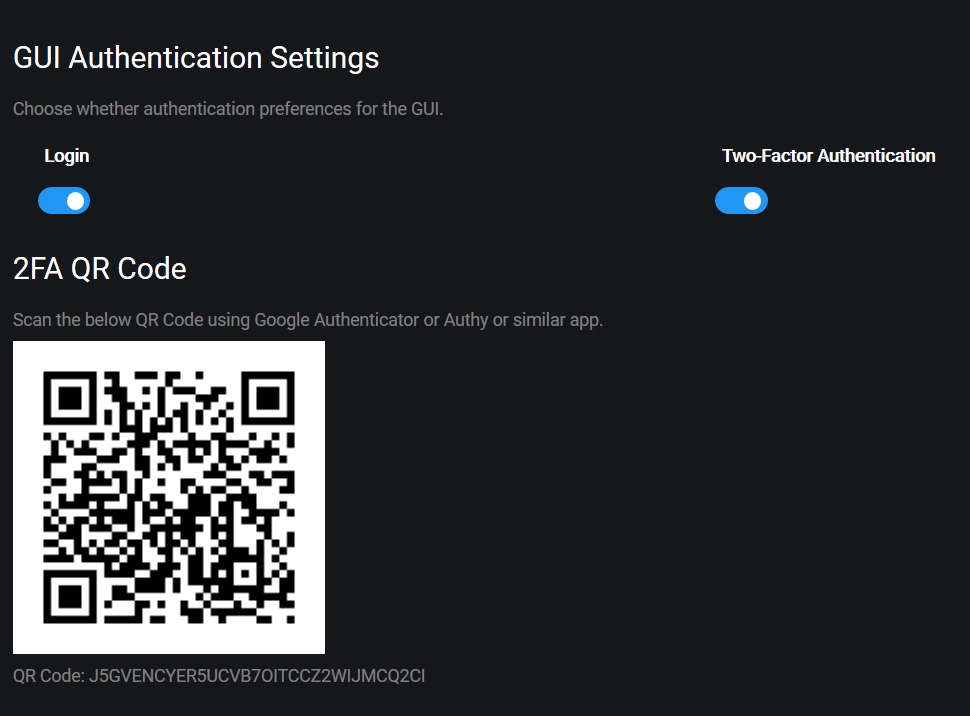

# Аутентификация

## Password - Пароль

The first time you visit the Gunbot GUI in your browser, you'll be asked to register your password.

## Two factor authentication \(2FA\) - Двухфакторная аутентификация \(2FA\)

Gunbot поддерживает двухфакторную аутентификацию, используя Google Authenticator, Authy или аналогичные приложения. 

Чтобы включить 2FA, перейдите в **Настройки&gt; Аутентификация.** **Settings** &gt; **Authentication**.

Не сканируйте QR-код на этом скриншоте. Используйте тот, который создан в вашей собственной установке.

