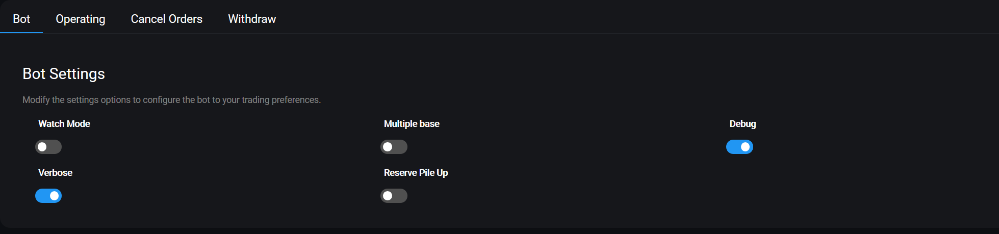
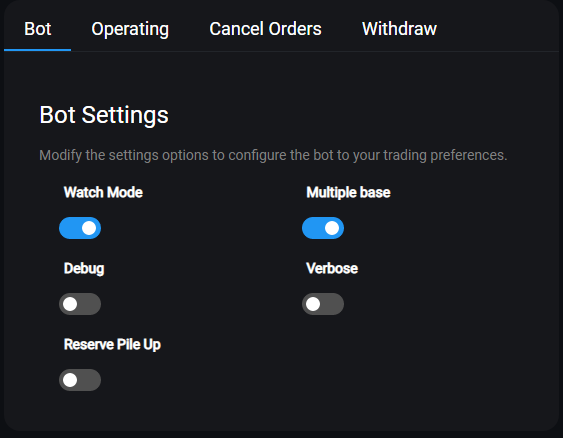
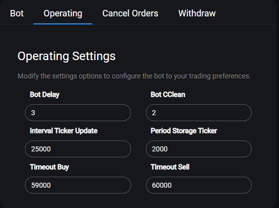
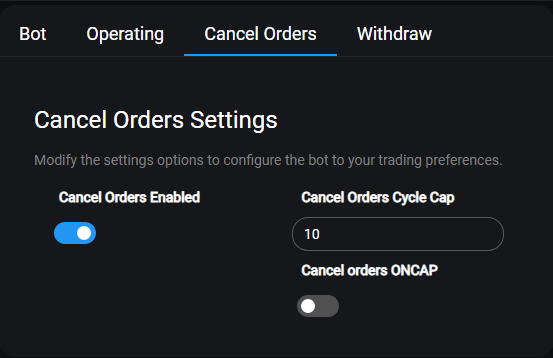
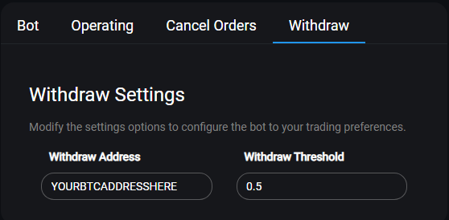

# Bot settings - Настройки бота

Меню настроек бота позволяет вам изменять глобальные настройки, которые влияют на все торговые пары. 

Чтобы изменить их, зайдите в **Настройки&gt; Настройки бота.** **Settings** &gt; **Bot Settings**.

## **Описание Настроек** 

Ниже вы найдете подробное описание всех доступных параметров для настроек бота. Несколько расширенных настроек доступны только в файле config.js.

## Bot Settings - Настройки бота - вкладка Bot

Измените параметры настроек, чтобы настроить бот для ваших торговых предпочтений.

### Watch Mode - Режим просмотра



При значении true Gunbot будет обрабатывать сконфигурированные пары, но не будет выставлять реальные ордера на покупку или продажу. Хорошо для тестирования.



**Values:** true or false - **Настройка**: \(правда или ложь\) Вкл или Выкл

**Default value:** false - **Настройка по умолчанию**: Выкл



Имя параметра в `config.js`: `WATCH_MODE`



### Multiple Base - Несколько баз



Используйте эту опцию для торговли парами с пересечением между котировкой и базой \(например, BTC-ETH и ETH-ADA\). 

При включении Gunbot не будет продавать все доступные единицы котировки при продаже, вместо этого он будет продавать только вложенные средства \(как определено в торговом лимите\). Также влияет на надстройку TradingView. 

Включайте только тогда, когда вам это действительно нужно.



**Values:** true or false - **Настройка**: \(правда или ложь\) вкл или выкл

**Default value:** false - **Настройка по умолчанию:** выкл



Имя параметра в `config.js`: `MULTIPLE_BASE`



### Debug - Отладка



Используется для отображения отладочных сообщений в боте, когда установлено значение true. 

Используйте это только если вам действительно нужно что-то отладить.



**Values:** true or false - **Настройка**: \(правда или ложь\) вкл или выкл

**Default value:** false - **Настройка по умолчанию:** выкл



Имя параметра в `config.js`: `VERBOSE`



### Verbose - Подробно



Установка этого значения в true приведет к более подробной информации, отображаемой в консоли.



**Values:** true or false - **Настройка**: \(правда или ложь\) вкл или выкл

**Default value:** false - **Настройка по умолчанию:** выкл



Имя параметра в `config.js`: `VERBOSE`



### Reserve Pile Up - Резервная куча



Если установлено значение true, прибыль от торговли будет автоматически добавляться в резерв средств и исключаться из дальнейшей торговли.



**Values:** true or false - **Настройка:** \(правда или ложь\) вкл или выкл

**Default value:** false - **Настройка по умолчанию:** выкл



Имя параметра в `config.js`: `RESERVE_PILE_UP`



## Operating Settings - Рабочие настройки - вкладка Operating 

### Bot Delay - Задержка Бота



Бот задержит обработку новой пары на заданное количество секунд. 

Полезно для случаев, когда Gunbot запрашивает данные быстрее, чем позволяет обмен API. Поскольку необходимая задержка зависит от количества пар и скорости, необходимой вашей системе для циклирования пар, рекомендуемые значения отсутствуют. 

Это глобальная настройка задержки бота, она игнорируется, если задана задержка обмена.



**Values -** **Настройка**: числовая - представляет время в секундах.

**Default value -**  **Настройка** **по умолчанию:** 1



Имя параметра в `config.js`: `BOT_DELAY`



### Bot CClean - Очистка бота



Этот параметр заставляет очистить кэш Gunbot, перезагружая бота каждые x часов. Этот параметр не запускает TRADES\_TIMEOUT. 

Установите это значение на низкое значение, только если у вашего бота действительно нет проблем с торговлей после длительного использования.



**Values -** **Настройка**: числовая - представляет время в часах.

**Default value -** **Настройка** **по умолчанию:** 2



Имя параметра в `config.js`: `BOT_CCLEAN`



### Interval Ticker Update - Обновление интервального тикера 

- устаревшая настройка

### Period Storage Ticker 

- тоже устаревшая настройка

### Timeout Buy - Тайм-аут покупки



Это внутренний тайм-аут, который предотвращает повторную покупку бота в течение заданного количества миллисекунд после размещения ордера на покупку.



**Values - Настройка**: числовая - представляют время в миллисекундах.

**Default value -** **Настройка** **по умолчанию:**  59000



Имя параметра в `config.js`: `timeout_buy`



### Timeout Sell - Тайм-аут продажи



Это внутренний тайм-аут, который не позволяет боту снова продавать в течение заданного количества миллисекунд после размещения ордера на продажу.



**Values - Настройка**: числовая - представляют время в миллисекундах.

**Default value -** **Настройка** **по умолчанию:**  60000



Имя параметра в `config.js`: `timeout_sell`



## Cancel Orders - Отмена ордеров

### Cancel Orders Enabled - Отмена ордеров включена



При значении true бот отменяет незаполненные или частично заполненные ордера, когда цена отошла от цены покупки или продажи. 

Установите значение false, если вы также торгуете вручную, чтобы бот не отменял ваши открытые ордера. 

Имитация **Fill Or Kill \(FOK\)**

Когда заказ не полностью или только частично заполнен и отменен, Gunbot попытается выполнить заказ, заменив его при текущей заявке/предложении bid/ask. 

Для ордеров на покупку это означает, что ордера FOK отправляются до тех пор, пока количество удерживаемых единиц котировки будет меньше TRADING\_LIMIT, а разница больше, чем MIN\_VOLUME\_TO\_BUY. 

Для ордеров на продажу это означает, что ордера FOK отправляются до тех пор, пока количество удерживаемых единиц котировки \(минус KEEP\_QUOTE, если используется\) стоит больше, чем MIN\_VOLUME\_TO\_SELL, а ставка выше точки безубыточности.



**Values:** true or false - **Настройка:** \(правда или ложь\) вкл или выкл

**Default value:** false - **Настройка по умолчанию:** выкл



Имя параметра в `config.js`: `CANCEL_ORDERS_ENABLED`



### Cancel Orders Cycle Cap - Отмена ордеров Cycle Cap



Это применимо только при использовании MAKER\_FEES или CANCEL\_ONCAP. 

Установите количество раундов, в которых отложенные ордера должны оставаться открытыми. По истечении этого количества раундов Gunbot отменит отложенный ордер.



**Values - Настройка:** числовая - представляет количество раундов.

**Default value - Настройка по умолчанию:** 10



Имя параметра в `config.js`: `CANCEL_ORDERS_CYCLE_CAP`



### Cancel Orders Oncap - Отмена ордеров Oncap



Включение этого параметра изменяет поведение отмены заказов: заказы отменяются после прохождения CANCEL\_ORDERS\_CYCLE\_CAP.



**Values:** числовая - представляет количество BTC

**Default value:** 0.5



Имя параметра в `config.js`: `CANCEL_ONCAP`



## Withdraw Settings - Настройки Вывода средств

### Withdraw Threshold - Порог снятия



Установите сумму BTC, которая будет накапливаться с помощью RESERVE\_PILE\_UP, прежде чем будет выполнен автоматический вывод средств.



**Values:** числовая - представляет количество BTC

**Default value:** 0.5



Имя параметра в`config.js`: `withdraw_threshold`



### Withdraw Address - Адрес снятия



Установите действительный адрес кошелька BTC, чтобы включить автоматический вывод средств при каждом достижении порога. 

Пожалуйста, используйте эту функцию только на свой страх и риск.



**Values:** строка

**Default value:** Ваш адрес BTC



Имя параметра в `config.js`: `withdraw_address`



### Json\_output



Устанавливает путь для хранения файлов .json. В этих файлах Gunbot сохраняет свою торговую информацию.



**Values:** текст, представляет местоположение папки.

**Default value:** ./json



Имя параметра в `config.js`: `json_output`



