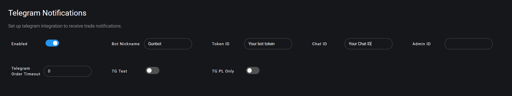

# Telegram уведомления


Бот Telegram \(ранее назывался CryptoSight\) полностью интегрирован в Gunbot. Все, что вам нужно сделать, чтобы запустить бот Telegram, это включить уведомления Telegram в настройках своего Gunbot. 

После настройки напишите / запустите своего бота, чтобы открыть меню.


## Demo video 



## Начало 

Чтобы настроить это, перейдите к **Settings** &gt; **Telegram**.

**Шаги по созданию бота Telegram** 

Уведомления работают, сначала создав персонального бота в Telegram, затем Gunbot подключается к этому боту и отправляет вам уведомления. 

Вот как создать бота:

1. Поговорите с [@botfather](https://telegram.me/botfather). Создайте нового бота с помощью команды / newbot и выберите имя и имя пользователя для своего бота. Сохраните показанный токен бота. 
2. Поговорите с [@myidbot](https://telegram.me/myidbot), чтобы увидеть свой идентификатор чата, сохраните его. 
3. Включите уведомления Telegram для Gunbot и введите токен и ID, которые вы только что собрали. Используйте идентификатор как для полей пользователя, так и для идентификатора администратора, это гарантирует, что только вы можете взаимодействовать с ботом Telegram. Кроме того, вы можете установить разделенный запятыми список для идентификатора администратора, указав несколько идентификаторов, которые могут взаимодействовать с ботом. 
4. Начните чат с именем пользователя, которое вы выбрали для своего бота, и нажмите кнопку запуска. Если вы не видите кнопку «Пуск», напишите «/ start» и затем нажмите на нее.


В настоящее время функциональность Telegram недоступна на платформах ARM.


## Описания настроек

Ниже вы найдете подробное описание всех доступных параметров для уведомлений Telegram.

### Enabled 

Включите это, чтобы Gunbot отправлял торговые уведомления через Telegram.

**Values:** true or false

**Default value:** false

Parameter name in `config.js`: `TELEGRAM_ENABLED`

### Bot Nickname 

Каждое торговое уведомление начинается с установленного здесь псевдонима. 

Используйте это, чтобы легко проверить, с какого экземпляра бота были отправлены уведомления.

**Values:** string

**Default value:** Gunbot

Parameter name in `config.js`: `TELEGRAM_NICK`

### Token 

Токен Telegram для вашего бота.

**Values:** string

**Default value:** YOURTOKEN

Parameter name in `config.js`: `TOKEN`

### Chat ID 

Идентификатор чата, по которому ваш бот отправляет свои сообщения.

**Valid options:**

_**"12345"**_

Целое положительное число для отправки сообщений непосредственно пользователю телеграммы. Используйте этот метод, когда вы просто хотите получать уведомления для личного использования. 

Чтобы найти свой telegram id, отправьте / запустите @MyTelegramID\_bot, и он ответит вашим идентификатором.

_**"-12345"**_

Отрицательное целое число, для отправки сообщений в групповой чат. 

Самый простой способ получить идентификатор группы - открыть логин [https://web.telegram.org](https://web.telegram.org) и перейти к группе. Теперь обратите внимание на URL, вы должны увидеть что-то вроде [https://web.telegram.org/\#/im?p=g12345](https://web.telegram.org/#/im?p=g12345) - число после части p = g является идентификатором группы. 

Это должно быть указано в chat\_id с символом - перед, в этом случае «-12345»

**Values:** string

**Default value:** 123456789

Parameter name in `config.js`: `chat_id`

### Admin ID 

Определяет, какие идентификаторы пользователей Telegram могут взаимодействовать с ботом. Должен использоваться рядом с идентификатором чата. 

Если вы оставите это значение пустым, каждый пользователь Telegram сможет взаимодействовать с вашим ботом Telegram. 

Несколько идентификаторов могут быть введены в виде списка через запятую.

**Values:** string

**Default value:** empty

Parameter name in `config.js`: `admin_id`

### TG PL Only 

При включении уведомления будут отправляться только для стратегических ордеров на продажу.

**Values:** true or false

**Default value:** false

Parameter name in `config.js`: `TG_PL_ONLY`

### Telegram Order Timeout 

При значении выше 0 вы получите диалоговое окно Telegram, чтобы вручную разрешить или запретить каждый заказ, который Gunbot хочет разместить. 

В течение установленного количества секунд вы можете разрешить или запретить заказ \(и он будет немедленно размещен\). По истечении времени ожидания без ответа заказ будет размещен на бирже.

**Values:** numerical, represent time in seconds.

**Default value:** 0

Parameter name in `config.js`: `TG_ORDER_TIMEOUT`

### TG Test 

Включите это, чтобы проверить, работает ли ваш бот Telegram. 

Тестовое сообщение будет отправлено в первом раунде для каждой пары. Отключить после проверки работоспособности вашего бота. 


Эта опция временно недоступна. Он будет активирован снова в одном из следующих обновлений Gunbot.


**Values:** true or false

**Default value:** false

Parameter name in `config.js`: `TG_TEST`

