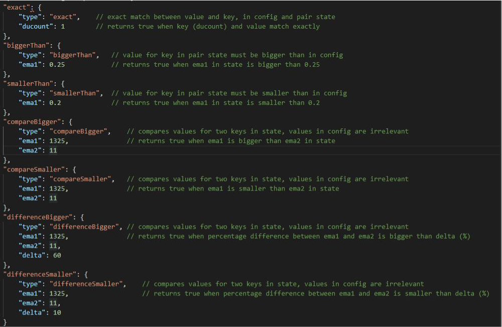

# AutoConfig - Автоконфигурации

Позволяет автоматически добавлять или удалять торговые пары или изменять переопределения стратегии смены пар - с помощью определенных вами критериев фильтра. 


Доступно для Gunbot Standard и выше.



В настоящее время нет графического интерфейса для AutoConfig. Вам нужно будет создать свой собственный файл конфигурации autoconfig.json, который содержит задания, которые он должен выполнить.

_Если вам неудобно редактировать конфигурационные файлы вручную, возможно, стоит подождать, пока графический интерфейс не начнет поддерживать AutoConfig._


Gunbot AutoConfig - это набор инструментов, которые можно использовать для динамического управления файлами конфигурации.

Вы можете создавать «задания», чтобы делать то, что вы обычно делаете вручную, например, сканировать обмен на наличие потенциальных пар и планировать задание в формате, похожем на cron.

Что вы можете сделать с AutoConfig:

* **Сканирование бирж и автоматическое добавление пар:** например, добавление пар с объемом&gt; 500 BTC, цена которых растет. Вы можете даже отфильтровать трейлинг-стопы по всем парам на бирже.
* **Имитируйте настройки фильтра для добавления пар:** вы можете собирать собственные данные для тестирования на истории и имитировать все возможные фильтры.
* **Сканирование биржи для удаления пар из вашей конфигурации**: например, удалить пары без баланса котировок, для которых объем упал ниже 100 BTC.
* **Измените стратегию для пар из своего конфига:** например, установите стратегию обработки сумок, когда пара действительно покупала, но цены сильно падали.
* **Измените задержку обмена.**
* **Контролируйте информацию о состоянии пары и автоматически устанавливайте переопределения пары:** например, установите другой DU\_BUYDOWN после первого раунда DU.
* **Обработка хеджирования в bitRage:** используйте свои собственные критерии, чтобы начать хеджирование от BTC до USDT в bitRage \(или наоборот\).
* **Установите пользовательские переменные в качестве выходных данных для задания фильтра,** которое можно использовать для фильтрации в других заданиях.

Чтобы использовать AutoConfig, вы должны иметь это в вашем файле config.js:

```python
"AutoConfig": {
        "enabled": true
    },
```

Кроме того, вы должны создать файл с именем autoconfig.json, который содержит одно или несколько заданий для обработки. В настоящее время нет графического интерфейса для управления этим файлом конфигурации, но вы можете найти подробную информацию о каждом типе работы в этой статье.

## Как это устроено 

Для AutoConfig существует один файл конфигурации \(autoconfig.json\), который может содержать одно или несколько заданий. Как только Gunbot \(re\) запускается или файл autoconfig.json изменяется, все задания в конфигурации планируются \(все ранее запланированные задания удаляются в этом процессе\).

Когда задание обрабатывается, изменения в config.js вносятся только для пар, прошедших каждый фильтр.

* Файл autoconfig.json может содержать одно или несколько заданий, каждое со своим расписанием.
* Одна работа всегда относится к одной бирже.
* Одна работа может иметь один или несколько фильтров.
* В рамках задания вы можете установить фильтры, для каких пар оно применяется.

Если задание успешно завершено, изменения записываются в config.js, и Gunbot перезапускается с новыми настройками. Если задание не вызывает изменений, например, потому что оно пытается разместить уже существующие переопределения, это не приведет к перезапуску Gunbot.

Расписания устанавливаются для каждого задания в [формате, аналогичном тому, как задаются задания cron](https://www.npmjs.com/package/node-schedule#cron-style-scheduling). Если вы не привыкли к формату, используйте веб-сайт, например [https://crontab-generator.org/](https://crontab-generator.org/), чтобы сгенерировать его.

## Типы работ \(с примерами конфигурации\) 

Каждый тип работы имеет ряд обязательных параметров, они описаны ниже для каждого типа работы.

Кроме того, существуют дополнительные параметры, которые можно использовать для расширения функциональности задания.

### Добавление пар 

**Введите имя в конфигурации:** addPairs

Этот тип работы использует [фильтры тикеров](https://inspire.gitbook.io/inspire/kak-rabotat-s-gunbot/untitled-3#ticker-filters-filtry-tikerov).

**Выход работы:** добавление торговых пар к определенной бирже.

**Варианты пар:**

**include**: включенные пары \(обрабатываются первыми\). Любая пара на бирже, которая соответствует любому из включений, будет обработана. В случае, если вы также используете опцию исключения, результирующие пары после обработки включений являются отправной точкой для обработки исключений, которая удалит элементы из этого списка пар.

Включенные элементы не обязательно должны быть именами целых пар, поскольку часть строки соответствует фактической паре, она будет включена. Вводится в виде списка через запятую, не допускает пробелов между элементами. Не может быть пустым.

**exclude**: исключенные пары \(обработанные последними\). Любая пара на бирже, которая соответствует любому из исключений, не будет обработана.

Исключенные элементы не обязательно должны быть именами целых пар, поскольку часть строки соответствует фактической паре, она будет исключена. Вводится в виде списка через запятую, не допускает пробелов между элементами. Может быть пустым.

**maxPairs**: максимальное количество разрешенных пар. В случае, если действие фильтра приведет к большему количеству пар, чем этот параметр, конфигурация будет заполнена до максимального количества разрешенных пар. Только разрешенные пары учитываются в maxPairs.

**Другие обязательные параметры:** 

**стратегия**: определяет стратегию, которая будет назначена парам, добавленным этим заданием. Это должно быть точное имя существующей стратегии в вашем файле config.js.

**snapshots**: определяет, сколько снимков тикера будет сохранено для выполнения расчетов. Относится к типам фильтров, которые включают Интервал в свое имя.

Например: для моментальных снимков установлено значение 10, это означает, что данные тикера за последние 10 раз, когда выполняются задания, сохраняются, и некоторые из значений в них используются для расчета средних значений по времени.

**Пример конфигурации** 

Пример ниже показывает работу, которая выполняет следующее:

* Сканирование тикеров Binance каждую минуту 
* Автоматически добавлять пары BTC-x \(но не BTC-DOGE, которая исключена\), которые имеют рейтинг 10 лучших по объему и для которых спрэд между спросом и предложением ниже 0,2%
*  Добавленные пары получают назначенную стратегию «усиления» 
* Позволяет использовать до 25 активных торговых пар в Binance

```python
{
    "addTopVolumePairs": {
      "pairs": {
        "exclude": "DOGE",
        "include": "BTC-",
        "maxPairs": 25,
        "exchange": "binance"
      },
      "filters": {
        "filter1": {
          "type": "maxVolumeRank",
          "max": 11 
        },
        "filter2": {
          "type": "maxSpreadPct",
          "max": 0.2 
        }
      },
      "schedule": "* * * * *",
      "snapshots": 1,
      "type": "addPairs",
      "strategy": "gain"
    }
  }
```

### Удаление пар 

**Введите имена в config**: removePairs \(использует фильтры тикера\) или removePairs2 \(использует фильтры состояния\). 

Вы должны иметь хотя бы одну пару для каждой биржи, на которой вы используете этот тип работы. 

**Вывод задания:** удаляет торговые пары из определенной биржи.

**Варианты пар:** 

**exclude**: пары, которые не следует сканировать для возможного удаления. Любая активная пара, которая соответствует любому из исключений, не будет обработана. 

Исключенные элементы не обязательно должны быть именами целых пар, поскольку часть строки соответствует фактической паре, она будет исключена. Вводится в виде списка через запятую, не допускает пробелов между элементами. Может быть пустым. 

Для этого типа фильтра нет параметров включения. Пары в вашем конфиге \(которые уже зациклены в Gunbot\) - это, по сути, список включений. 

**noBag** \(true / false\): при значении true только пары с балансом ниже MIN\_VOLUME\_TO\_SELL, которые не имеют открытых ордеров и не участвуют в разворотной торговле, фильтруются для возможного удаления. Если установлено значение false, все пары в конфигурации фильтруются. 

**removeDisabled** \(true / false\): при значении true при каждом запуске задания removePairs удаляются все отключенные пары для обмена, в котором выполняется задание, независимо от настроек фильтра. Полезно, например, когда вы используете COUNT\_SELL.

**Другие обязательные параметры:** 

**snapshots**: определяет, сколько снимков тикера будет сохранено для выполнения расчетов. Относится к типам фильтров, которые включают Интервал в свое имя. 

Например: для моментальных снимков установлено значение 10, это означает, что данные тикера за последние 10 раз, когда выполняются задания, сохраняются, и некоторые из значений в них используются для расчета средних значений по времени.

**Пример конфигурации** 

Пример ниже показывает работу, которая выполняет следующее: 

* Сканирование тикеров Binance каждые десять минут 
* Удалите любую пару, которая имеет рейтинг громкости ниже 20, кроме пар, содержащих в названии BNB или XVG. 
* Кроме того, удалите все отключенные пары из конфигурации.

```python
{
  "removeCrap": {
    "pairs": {
      "exclude": "BNB,XVG",
      "noBag": false,
      "removeDisabled": true,
      "exchange": "binance"
    },
    "filters": {
      "filter1": {
        "type": "minVolumeRank",
        "min": 20
      }
    },
    "schedule": "*/10 * * * *",
    "snapshots": 1,
    "type": "removePairs"
  }
}
```


### Изменить стратегию 

**Введите имена в config:** changeStrategy \(использует фильтры тикера\) или changeStrategy2 \(использует фильтры состояния\). 

_Этот тип задания в основном совпадает с тем, как работает removePairs, но он меняет стратегию пар вместо удаления пары._ 

Вы должны иметь хотя бы одну пару для каждой биржи, на которой вы используете этот тип работы. 

**Выход задания:** изменить назначенную торговую стратегию для пар на одной бирже.


**Варианты пар:** 

**exclude**: пары, которые не следует сканировать для возможного удаления. Любая активная пара, которая соответствует любому из исключений, не будет обработана. 

Исключенные элементы не обязательно должны быть именами целых пар, поскольку часть строки соответствует фактической паре, она будет исключена. Вводится в виде списка через запятую, не допускает пробелов между элементами. Может быть пустым. 

Для этого типа фильтра нет параметров включения. Пары в вашем конфиге \(которые уже зациклены в Gunbot\) - это, по сути, список включений. 

**bag** \(true / false\): при значении true только пары с балансом ниже MIN\_VOLUME\_TO\_SELL, которые не имеют открытых ордеров и не участвуют в разворотной торговле, фильтруются для возможного удаления. Если установлено значение false, все пары в конфигурации фильтруются.


**Другой обязательный параметр:** 

**стратегия**: целевая стратегия для пар, соответствующих всем фильтрам. 

**snapshots**: определяет, сколько снимков тикера будет сохранено для выполнения расчетов. Относится к типам фильтров, которые включают Интервал в свое имя. 

**Например**: для моментальных снимков установлено значение 10, это означает, что данные тикера за последние 10 раз, когда выполняются задания, сохраняются, и некоторые из значений в них используются для расчета средних значений по времени.


**Пример конфигурации** 

Пример ниже показывает работу, которая выполняет следующее: 

* Сканирование тикеров Binance каждые 15 минут 
* Измените назначенную стратегию для любой пары, которая имеет средний торговый объем, кроме BTC-LTC 
* Присвойте стратегию "baghandler" этим парам

```python
{
    "changeStrat": {
        "pairs": {
            "exclude": "BNB-LTC",
            "bag": true,
            "exchange": "binance"
        },
        "filters": {
            "filter1": {
                "type": "belowMedianVolume"
            }
        },
        "schedule": "*/15 * * * *",
        "snapshots": 1,
        "type": "changeStrategy",
        "strategy": "baghandler"
    }
}
```


### Управление переопределениями 

**Введите имя в конфигурации:** manageOverrides 

Этот тип задания использует фильтры состояния. 

**Выходные данные задания:** изменяет переопределения для пар на конкретном обмене.


**Варианты пар:** 

**include**: включенные пары \(обрабатываются первыми\), не могут быть пустыми. Любая активная торговая пара, которая соответствует любому из включений, будет обработана. В случае, если вы также используете опцию исключения, результирующие пары после обработки включений являются отправной точкой для обработки исключений, которая удалит элементы из этого списка пар. 

Включенные элементы не обязательно должны быть именами целых пар, поскольку часть строки соответствует фактической паре, она будет включена. Вводится в виде списка через запятую, не допускает пробелов между элементами. Не может быть пустым. 

**exclude**: исключенные пары \(обработанные последними\). Любая активная торговая пара, которая соответствует любому из исключений, не будет обработана. 

Исключенные элементы не обязательно должны быть именами целых пар, поскольку часть строки соответствует фактической паре, она будет исключена. Вводится в виде списка через запятую, не допускает пробелов между элементами. Может быть пустым.


**Другие обязательные параметры:** 

**переопределения**: содержат одно или несколько переопределений, они будут установлены для каждой пары, которая проходит все фильтры при выполнении задания. 

**clearOverrides** \(true / false\): если установлено значение true, все существующие переопределения для пары удаляются перед размещением новых.


**Пример конфигурации** 

Пример ниже показывает работу, которая выполняет следующее: 

* Сканируйте пары Binance каждую минуту, обрабатывайте фильтры по всем активным торговым парам, которые включают «USDT» или «BNB» и не включают «DOGE» или «ETH» в названии пары. 
* Установите переопределение DU\_BUYDOWN для всех пар, у которых есть ducount 1

```python
{
    "DynamicDU1": {
        "pairs": {
            "exclude": "DOGE,ETH",
            "include": "USDT,BNB",
            "exchange": "binance"
        },
        "filters": {
            "ducount": {
                "type": "exact",
                "ducount": 1
            }
        },
        "overrides": {
            "DU_BUYDOWN": 3
        },
        "clearOverrides": false,
        "schedule": "* * * * *",
        "type": "manageOverrides"
  }
}
```


### Изменение задержки обмена 

**Введите имя в конфигурации:** changeDelay 

Этот тип задания использует фильтры состояния. 

**Выход задания:** изменяет задержку обмена для конкретного обмена.


**Варианты пар:**

**include:** включенные пары \(обрабатываются первыми\), не могут быть пустыми. Любая активная торговая пара, которая соответствует любому из включений, будет обработана. В случае, если вы также используете опцию исключения, результирующие пары после обработки включений являются отправной точкой для обработки исключений, которая удалит элементы из этого списка пар. 

Включенные элементы не обязательно должны быть именами целых пар, поскольку часть строки соответствует фактической паре, она будет включена. Вводится в виде списка через запятую, не допускает пробелов между элементами. Не может быть пустым. 

**exclude:** исключенные пары \(обработанные последними\). Любая активная торговая пара, которая соответствует любому из исключений, не будет обработана. 

Исключенные элементы не обязательно должны быть именами целых пар, поскольку часть строки соответствует фактической паре, она будет исключена. Вводится в виде списка через запятую, не допускает пробелов между элементами. Может быть пустым.


**Другой обязательный параметр**: 

**delay**: задержка обмена в секундах, это значение будет установлено, когда одна или несколько пар в задании пройдут все фильтры.


**Пример конфигурации** 

Пример ниже показывает работу, которая выполняет следующее: 

* Сканируйте пары Binance каждую минуту, обрабатывайте фильтры по всем активным торговым парам, которые включают «USDT» или «BNB» и не включают «DOGE» или «ETH» в названии пары. 
* Установите задержку обмена для Binance на 10, если хотя бы одна пара соответствует фильтру

```python
{
    "DynamicDU1": {
        "pairs": {
            "exclude": "DOGE,ETH",
            "include": "USDT,BNB",
            "exchange": "binance"
        },
        "filters": {
            "ducount": {
                "type": "exact",
                "ducount": 1
            }
        },
        "delay": 10,
        "schedule": "* * * * *",
        "type": "changeDelay"
  }
}
```


### Хеджирование \(специфично для bitRage\) 

**Введите имя в конфигурации:** `hedge`

Этот тип задания использует фильтры состояния. 

**Вывод задания:** инициирует хеджирование в bitRage.

**Варианты пар:** 

**include**: включенные пары \(обрабатываются первыми\), не могут быть пустыми. Любая активная торговая пара, которая соответствует любому из включений, будет обработана. В случае, если вы также используете опцию исключения, результирующие пары после обработки включений являются отправной точкой для обработки исключений, которая удалит элементы из этого списка пар. 

Включенные элементы не обязательно должны быть именами целых пар, поскольку часть строки соответствует фактической паре, она будет включена. Вводится в виде списка через запятую, не допускает пробелов между элементами. Не может быть пустым. 

**exclude**: исключенные пары \(обработанные последними\). Любая активная торговая пара, которая соответствует любому из исключений, не будет обработана. 

Исключенные элементы не обязательно должны быть именами целых пар, поскольку часть строки соответствует фактической паре, она будет исключена. Вводится в виде списка через запятую, не допускает пробелов между элементами. Может быть пустым.


**Другие обязательные параметры:** 

**hedgeTo** \(USDT / BTC\): определяет, какую валюту начать хеджировать. 

**brStrat**: определяет, какая стратегия используется для bitRage.


**Пример конфигурации** 

Пример ниже показывает работу, которая выполняет следующее: 

* Сканирование на переменную пользователя, каждые минуты 
* Как только эта переменная найдена, она размещает блоки FilterBase, FilterQuote и FilterPair, как определено в задании, для kucoin \(эта часть является необязательной\) 
* Как только эта переменная найдена, она вносит следующие изменения в стратегию 

  `bitrageStrat`, она устанавливает / изменяет следующие параметры, чтобы началось хеджирование:

```python
"AUTOSELL": true,
"MAIN_BASE": "USDT",
"BR_PANIC_SELL": true,
```

```python
{
    "Hedge_to_USDT": {
		"pairs": {
			"exclude": "",
			"include": "",
			"exchange": "kucoin",
			"filteredBase": [
				"TUSD",
				"PAX",
				"KCS",
				"NUSD",
				"ETH",
				"DAI",
				"USDC",
				"TRX",
				"NEO",
				"BTC"
			],
			"filteredQuote": [
				"GGC"
			],
			"filteredPair": [
				"BTC-GGC",
				"USDT-GGC",
				"BTC-KCS",
				"USDT-KCS",
				"KCS-XRP",
				"KCS-EOS",
				"KCS-LTC",
				"KCS-NEO",
				"KCS-MTV",
				"KCS-GO",
				"KCS-CS",
				"ETH-KCS",
				"NEO-EOS",
				"DAI-BTC",
				"DAI-ETH",
				"DAI-MKR",
				"DAI-USDT"
			]
		},
		"filters": {
			"variable": {
				"type": "variableExact",
				"readyToHedge": "USDT"
			}
		},
		"setVariable": {
			"hedgingStarted": true
		},
		"schedule": "* * * * *",
		"type": "hedge",
		"hedgeTo": "USDT",
		"brStrat": "bitrageStrat"
	},
}
```


### Необязательные параметры 

Задания могут быть расширены дополнительными параметрами, некоторые из них работают на всех типах работ, некоторые относятся к определенным типам работ.


**Необязательные параметры для всех типов работ:**

**enabled** \(true / false\): при значении false задание отключено и не будет выполнено. 

**debug** \(true / false\): когда true, задание создает подробные журналы в консоли для каждого фильтра. 

[настройки для пользовательских переменных ](https://wiki.gunthy.org/how-to-work-with-gunbot/autoconfig#user-variables)

**brStrat**: определяет, какая стратегия используется для bitRage. Требуется только если вы используете Autoconfig для автоматизации хеджирования для bitRage.


**Необязательные параметры для заданий, использующих фильтры тикеров:** 

**resume** \(true / false\): при значении true сохраненные снимки тикеров загружаются из файла после перезапуска Gunbot. Если false, история должна быть восстановлена ​​после перезапуска. 

**history**: определяет, сколько записей тикера должно храниться в хранилище истории. 

**historyInterval**: определяет минимальный интервал в минутах между записями истории.


**Необязательный параметр для addPairs и manageOverrides** 

**setITB** \(true / false\): когда true, каждая пара, соответствующая всем фильтрам, получит дополнительное переопределение `IGNORE_TRADES_BEFORE`, значение которого является меткой времени для времени выполнения задания.


**Необязательные параметры для addPairs** 

**переопределения**: этот тип задания также может добавлять переопределения при добавлении новых пар. Для этого добавьте в задание раздел с переопределениями, как в задании manageOverrides. 

**Фильтры Bitrage**: при использовании для Bitrage задание addPairs может заменить содержимое настроек фильтра обмена. Для этого добавьте фильтры в парный раздел задания, как показано ниже:

```python
"pairs": {
            "exclude": "",
            "include": "BTC-",
            "maxPairs": 10,
            "exchange": "kucoin",
            "filteredQuote": ["DOGE"],
      "filteredPair": ["BTC-DOGE"],
      "filteredBase": ["BTC","ETH","USDS","TUSD","USDC","PAX","XRP","TRX","BUSD","NGN"]
        },
```


### Необязательные параметры для `removePairs`

**removeBase**: может использоваться для удаления всех пар из указанной базовой валюты, которые используют стратегию bitRage, указанную в `brStrat`. Это полезно для очистки пар с определенной базы после хеджирования.

**notRemoveBefore** \(в разделе пар\): значение в минутах. Не удаляйте пары из конфигурации, если они не находятся в конфигурации дольше, чем указано.


#### Необязательные параметры для `hedge`

**Bitrage filters:** при использовании для Bitrage задание addPairs может заменить содержимое настроек фильтра обмена. Для этого добавьте фильтры в секцию пар, как показано выше.

## Параметры фильтра

### Ticker filters **-** Фильтры тикеров

**Для типов работы:** `addPairs`, `removePairs`, `changeStrategy`

Фильтры тикеров используют данные, собранные с тикеров обмена, в момент выполнения задания. 

Вы можете использовать следующие типы фильтров для добавления и удаления пар. Обратите внимание, что не каждый тип фильтра работает на каждой бирже, поскольку некоторые биржи не предоставляют необходимые данные. На Huobi AutoConfig использует «последнюю» цену вместо bid / ask для всех фильтров, которые работают с ценами.


Фильтры для цен используют запрос при добавлении пар и ставку при фильтрации для удаления или изменения стратегии.

<table>
  <thead>
    <tr>
      <th style="text-align:left"><em>&#x422;&#x438;&#x43F;</em>
      </th>
      <th style="text-align:left">&#x41E;&#x43F;&#x438;&#x441;&#x430;&#x43D;&#x438;&#x435;</th>
      <th style="text-align:left">&#x414;&#x43E;&#x43F;&#x43E;&#x43B;&#x43D;&#x438;&#x442;&#x435;&#x43B;&#x44C;&#x43D;&#x43E;</th>
    </tr>
  </thead>
  <tbody>
    <tr>
      <td style="text-align:left"><code>minPrice</code>
      </td>
      <td style="text-align:left">&#x424;&#x438;&#x43B;&#x44C;&#x442;&#x440; &#x432;&#x43E;&#x437;&#x432;&#x440;&#x430;&#x449;&#x430;&#x435;&#x442;
        true, &#x43A;&#x43E;&#x433;&#x434;&#x430; &#x446;&#x435;&#x43D;&#x430;
        &#x432;&#x44B;&#x448;&#x435; &#x443;&#x441;&#x442;&#x430;&#x43D;&#x43E;&#x432;&#x43B;&#x435;&#x43D;&#x43D;&#x43E;&#x439;.</td>
      <td
      style="text-align:left">n/a</td>
    </tr>
    <tr>
      <td style="text-align:left"><code>maxPrice</code>
      </td>
      <td style="text-align:left">&#x424;&#x438;&#x43B;&#x44C;&#x442;&#x440; &#x432;&#x43E;&#x437;&#x432;&#x440;&#x430;&#x449;&#x430;&#x435;&#x442;
        true, &#x43A;&#x43E;&#x433;&#x434;&#x430; &#x446;&#x435;&#x43D;&#x430;
        &#x43D;&#x438;&#x436;&#x435; &#x443;&#x441;&#x442;&#x430;&#x43D;&#x43E;&#x432;&#x43B;&#x435;&#x43D;&#x43D;&#x43E;&#x439;.</td>
      <td
      style="text-align:left">n/a</td>
    </tr>
    <tr>
      <td style="text-align:left"><code>minPricePctChangeInterval</code>
      </td>
      <td style="text-align:left">&#x424;&#x438;&#x43B;&#x44C;&#x442;&#x440; &#x432;&#x43E;&#x437;&#x432;&#x440;&#x430;&#x449;&#x430;&#x435;&#x442;
        &#x437;&#x43D;&#x430;&#x447;&#x435;&#x43D;&#x438;&#x435; true, &#x435;&#x441;&#x43B;&#x438;
        &#x442;&#x435;&#x43A;&#x443;&#x449;&#x430;&#x44F; &#x446;&#x435;&#x43D;&#x430;
        &#x43F;&#x43E; &#x43A;&#x440;&#x430;&#x439;&#x43D;&#x435;&#x439; &#x43C;&#x435;&#x440;&#x435;
        &#x43D;&#x430; &#x445;% &#x432;&#x44B;&#x448;&#x435; &#x441;&#x440;&#x435;&#x434;&#x43D;&#x435;&#x439;
        &#x446;&#x435;&#x43D;&#x44B; &#x432;&#x441;&#x435;&#x445; &#x441;&#x43D;&#x438;&#x43C;&#x43A;&#x43E;&#x432;.</td>
      <td
      style="text-align:left"><code>lastSnapshots</code>
        </td>
    </tr>
    <tr>
      <td style="text-align:left"><code>maxPricePctChangeInterval</code>
      </td>
      <td style="text-align:left">&#x424;&#x438;&#x43B;&#x44C;&#x442;&#x440; &#x432;&#x43E;&#x437;&#x432;&#x440;&#x430;&#x449;&#x430;&#x435;&#x442;
        &#x437;&#x43D;&#x430;&#x447;&#x435;&#x43D;&#x438;&#x435; true, &#x435;&#x441;&#x43B;&#x438;
        &#x442;&#x435;&#x43A;&#x443;&#x449;&#x430;&#x44F; &#x446;&#x435;&#x43D;&#x430;
        &#x43F;&#x43E; &#x43A;&#x440;&#x430;&#x439;&#x43D;&#x435;&#x439; &#x43C;&#x435;&#x440;&#x435;
        &#x43D;&#x430; &#x445;% &#x432;&#x44B;&#x448;&#x435; &#x441;&#x440;&#x435;&#x434;&#x43D;&#x435;&#x439;
        &#x446;&#x435;&#x43D;&#x44B; &#x432;&#x441;&#x435;&#x445; &#x441;&#x43D;&#x438;&#x43C;&#x43A;&#x43E;&#x432;.</td>
      <td
      style="text-align:left"><code>lastSnapshots</code>
        </td>
    </tr>
    <tr>
      <td style="text-align:left"><code>minVolumePctChangeInterval</code>
      </td>
      <td style="text-align:left">&#x424;&#x438;&#x43B;&#x44C;&#x442;&#x440; &#x432;&#x43E;&#x437;&#x432;&#x440;&#x430;&#x449;&#x430;&#x435;&#x442;
        &#x437;&#x43D;&#x430;&#x447;&#x435;&#x43D;&#x438;&#x435; true, &#x435;&#x441;&#x43B;&#x438;
        &#x442;&#x435;&#x43A;&#x443;&#x449;&#x438;&#x439; 24-&#x447;&#x430;&#x441;&#x43E;&#x432;&#x43E;&#x439;
        &#x43E;&#x431;&#x44A;&#x435;&#x43C; &#x43F;&#x43E; &#x43A;&#x440;&#x430;&#x439;&#x43D;&#x435;&#x439;
        &#x43C;&#x435;&#x440;&#x435; &#x43D;&#x430; &#x445;% &#x432;&#x44B;&#x448;&#x435;
        &#x441;&#x440;&#x435;&#x434;&#x43D;&#x435;&#x433;&#x43E; 24-&#x447;&#x430;&#x441;&#x43E;&#x432;&#x43E;&#x433;&#x43E;
        &#x43E;&#x431;&#x44A;&#x435;&#x43C;&#x430; &#x432;&#x441;&#x435;&#x445;
        &#x441;&#x43D;&#x438;&#x43C;&#x43A;&#x43E;&#x432;.</td>
      <td style="text-align:left"><code>lastSnapshots</code>
      </td>
    </tr>
    <tr>
      <td style="text-align:left"><code>maxVolumePctChangeInterval</code>
      </td>
      <td style="text-align:left">&#x424;&#x438;&#x43B;&#x44C;&#x442;&#x440; &#x432;&#x43E;&#x437;&#x432;&#x440;&#x430;&#x449;&#x430;&#x435;&#x442;
        &#x437;&#x43D;&#x430;&#x447;&#x435;&#x43D;&#x438;&#x435; true, &#x435;&#x441;&#x43B;&#x438;
        &#x442;&#x435;&#x43A;&#x443;&#x449;&#x438;&#x439; 24-&#x447;&#x430;&#x441;&#x43E;&#x432;&#x43E;&#x439;
        &#x43E;&#x431;&#x44A;&#x435;&#x43C; &#x43F;&#x43E; &#x43A;&#x440;&#x430;&#x439;&#x43D;&#x435;&#x439;
        &#x43C;&#x435;&#x440;&#x435; &#x43D;&#x430; &#x445;% &#x43D;&#x438;&#x436;&#x435;
        &#x441;&#x440;&#x435;&#x434;&#x43D;&#x435;&#x433;&#x43E; 24-&#x447;&#x430;&#x441;&#x43E;&#x432;&#x43E;&#x433;&#x43E;
        &#x43E;&#x431;&#x44A;&#x435;&#x43C;&#x430; &#x432;&#x441;&#x435;&#x445;
        &#x441;&#x43D;&#x438;&#x43C;&#x43A;&#x43E;&#x432;.</td>
      <td style="text-align:left"><code>lastSnapshots</code>
      </td>
    </tr>
    <tr>
      <td style="text-align:left"><code>minVolume24h</code>
      </td>
      <td style="text-align:left">&#x424;&#x438;&#x43B;&#x44C;&#x442;&#x440; &#x432;&#x43E;&#x437;&#x432;&#x440;&#x430;&#x449;&#x430;&#x435;&#x442;
        &#x438;&#x441;&#x442;&#x438;&#x43D;&#x443;, &#x435;&#x441;&#x43B;&#x438;
        &#x433;&#x440;&#x43E;&#x43C;&#x43A;&#x43E;&#x441;&#x442;&#x44C; &#x437;&#x430;
        24 &#x447;&#x430;&#x441;&#x430; &#x432;&#x44B;&#x448;&#x435; &#x443;&#x441;&#x442;&#x430;&#x43D;&#x43E;&#x432;&#x43B;&#x435;&#x43D;&#x43D;&#x43E;&#x439;,
        &#x433;&#x440;&#x43E;&#x43C;&#x43A;&#x43E;&#x441;&#x442;&#x44C; &#x432;
        &#x431;&#x430;&#x437;&#x435;.</td>
      <td style="text-align:left">n/a</td>
    </tr>
    <tr>
      <td style="text-align:left"><code>maxVolume24h</code>
      </td>
      <td style="text-align:left">&#x424;&#x438;&#x43B;&#x44C;&#x442;&#x440; &#x432;&#x43E;&#x437;&#x432;&#x440;&#x430;&#x449;&#x430;&#x435;&#x442;
        true, &#x435;&#x441;&#x43B;&#x438; &#x433;&#x440;&#x43E;&#x43C;&#x43A;&#x43E;&#x441;&#x442;&#x44C;
        &#x437;&#x430; 24 &#x447;&#x430;&#x441;&#x430; &#x43D;&#x438;&#x436;&#x435;
        &#x443;&#x441;&#x442;&#x430;&#x43D;&#x43E;&#x432;&#x43B;&#x435;&#x43D;&#x43D;&#x43E;&#x439;,
        &#x433;&#x440;&#x43E;&#x43C;&#x43A;&#x43E;&#x441;&#x442;&#x44C; &#x432;
        &#x431;&#x430;&#x437;&#x435;.</td>
      <td style="text-align:left">n/a</td>
    </tr>
    <tr>
      <td style="text-align:left"><code>minVolatilityPct24h</code>
      </td>
      <td style="text-align:left">&#x424;&#x438;&#x43B;&#x44C;&#x442;&#x440; &#x432;&#x43E;&#x437;&#x432;&#x440;&#x430;&#x449;&#x430;&#x435;&#x442;
        true, &#x435;&#x441;&#x43B;&#x438; &#x438;&#x437;&#x43C;&#x435;&#x43D;&#x435;&#x43D;&#x438;&#x435;
        &#x446;&#x435;&#x43D;&#x44B; &#x432; &#x442;&#x435;&#x447;&#x435;&#x43D;&#x438;&#x435;
        24 &#x447;&#x430;&#x441;&#x43E;&#x432; &#x43F;&#x440;&#x435;&#x432;&#x44B;&#x448;&#x430;&#x435;&#x442;
        &#x443;&#x441;&#x442;&#x430;&#x43D;&#x43E;&#x432;&#x43B;&#x435;&#x43D;&#x43D;&#x43E;&#x435;
        &#x437;&#x43D;&#x430;&#x447;&#x435;&#x43D;&#x438;&#x435;.</td>
      <td style="text-align:left">n/a</td>
    </tr>
    <tr>
      <td style="text-align:left"><code>maxVolatilityPct24h</code>
      </td>
      <td style="text-align:left">&#x424;&#x438;&#x43B;&#x44C;&#x442;&#x440; &#x432;&#x43E;&#x437;&#x432;&#x440;&#x430;&#x449;&#x430;&#x435;&#x442;
        true, &#x435;&#x441;&#x43B;&#x438; &#x438;&#x437;&#x43C;&#x435;&#x43D;&#x435;&#x43D;&#x438;&#x435;
        &#x446;&#x435;&#x43D;&#x44B; &#x432; &#x442;&#x435;&#x447;&#x435;&#x43D;&#x438;&#x435;
        24 &#x447;&#x430;&#x441;&#x43E;&#x432; &#x43D;&#x438;&#x436;&#x435; &#x443;&#x441;&#x442;&#x430;&#x43D;&#x43E;&#x432;&#x43B;&#x435;&#x43D;&#x43D;&#x43E;&#x433;&#x43E;.</td>
      <td
      style="text-align:left">n/a</td>
    </tr>
    <tr>
      <td style="text-align:left"><code>minSpreadPct</code>
      </td>
      <td style="text-align:left">&#x424;&#x438;&#x43B;&#x44C;&#x442;&#x440; &#x432;&#x43E;&#x437;&#x432;&#x440;&#x430;&#x449;&#x430;&#x435;&#x442;
        true, &#x435;&#x441;&#x43B;&#x438; &#x440;&#x430;&#x437;&#x43D;&#x438;&#x446;&#x430;
        &#x432; &#x43F;&#x440;&#x43E;&#x446;&#x435;&#x43D;&#x442;&#x430;&#x445;
        &#x43C;&#x435;&#x436;&#x434;&#x443; &#x437;&#x430;&#x44F;&#x432;&#x43A;&#x43E;&#x439;
        &#x438; &#x437;&#x430;&#x44F;&#x432;&#x43A;&#x43E;&#x439; &#x43F;&#x440;&#x435;&#x432;&#x44B;&#x448;&#x430;&#x435;&#x442;
        &#x443;&#x441;&#x442;&#x430;&#x43D;&#x43E;&#x432;&#x43B;&#x435;&#x43D;&#x43D;&#x443;&#x44E;.</td>
      <td
      style="text-align:left">n/a</td>
    </tr>
    <tr>
      <td style="text-align:left"><code>maxSpreadPct</code>
      </td>
      <td style="text-align:left">&#x424;&#x438;&#x43B;&#x44C;&#x442;&#x440; &#x432;&#x43E;&#x437;&#x432;&#x440;&#x430;&#x449;&#x430;&#x435;&#x442;
        &#x437;&#x43D;&#x430;&#x447;&#x435;&#x43D;&#x438;&#x435; true, &#x435;&#x441;&#x43B;&#x438;
        &#x43F;&#x440;&#x43E;&#x446;&#x435;&#x43D;&#x442;&#x43D;&#x430;&#x44F;
        &#x440;&#x430;&#x437;&#x43D;&#x438;&#x446;&#x430; &#x43C;&#x435;&#x436;&#x434;&#x443;
        &#x437;&#x430;&#x44F;&#x432;&#x43A;&#x43E;&#x439; &#x438; &#x43F;&#x440;&#x435;&#x434;&#x43B;&#x43E;&#x436;&#x435;&#x43D;&#x438;&#x435;&#x43C;
        &#x43D;&#x438;&#x436;&#x435; &#x443;&#x441;&#x442;&#x430;&#x43D;&#x43E;&#x432;&#x43B;&#x435;&#x43D;&#x43D;&#x43E;&#x439;.</td>
      <td
      style="text-align:left">n/a</td>
    </tr>
    <tr>
      <td style="text-align:left"><code>minSlopePctInterval</code>
      </td>
      <td style="text-align:left">
        <p>&#x424;&#x438;&#x43B;&#x44C;&#x442;&#x440; &#x432;&#x43E;&#x437;&#x432;&#x440;&#x430;&#x449;&#x430;&#x435;&#x442;
          true, &#x435;&#x441;&#x43B;&#x438; &#x43D;&#x430;&#x43A;&#x43B;&#x43E;&#x43D;
          &#x434;&#x43B;&#x44F; &#x432;&#x441;&#x435;&#x445; &#x446;&#x435;&#x43D;
          &#x432; &#x441;&#x43D;&#x438;&#x43C;&#x43A;&#x430;&#x445; &#x431;&#x43E;&#x43B;&#x44C;&#x448;&#x435;
          &#x437;&#x430;&#x434;&#x430;&#x43D;&#x43D;&#x43E;&#x433;&#x43E;.</p>
        <p>&#x41D;&#x430;&#x43A;&#x43B;&#x43E;&#x43D; &#x432;&#x44B;&#x440;&#x430;&#x436;&#x430;&#x435;&#x442;&#x441;&#x44F;
          &#x432; &#x43F;&#x440;&#x43E;&#x446;&#x435;&#x43D;&#x442;&#x430;&#x445;
          &#x43E;&#x442; &#x43F;&#x43E;&#x441;&#x43B;&#x435;&#x434;&#x43D;&#x435;&#x439;
          &#x446;&#x435;&#x43D;&#x44B;. &#x41D;&#x430;&#x43A;&#x43B;&#x43E;&#x43D;
          1 &#x43E;&#x437;&#x43D;&#x430;&#x447;&#x430;&#x435;&#x442;, &#x447;&#x442;&#x43E;,
          &#x441;&#x43E;&#x433;&#x43B;&#x430;&#x441;&#x43D;&#x43E; &#x43F;&#x440;&#x43E;&#x441;&#x442;&#x43E;&#x439;
          &#x43B;&#x438;&#x43D;&#x435;&#x439;&#x43D;&#x43E;&#x439; &#x440;&#x435;&#x433;&#x440;&#x435;&#x441;&#x441;&#x438;&#x438;,
          &#x446;&#x435;&#x43D;&#x430; &#x441;&#x43B;&#x435;&#x434;&#x443;&#x44E;&#x449;&#x435;&#x433;&#x43E;
          &#x441;&#x43E;&#x431;&#x440;&#x430;&#x43D;&#x43D;&#x43E;&#x433;&#x43E;
          &#x442;&#x438;&#x43A;&#x435;&#x440;&#x430;, &#x432;&#x435;&#x440;&#x43E;&#x44F;&#x442;&#x43D;&#x43E;,
          &#x431;&#x443;&#x434;&#x435;&#x442; &#x43D;&#x430; 1% &#x432;&#x44B;&#x448;&#x435;,
          &#x447;&#x435;&#x43C; &#x43F;&#x43E;&#x441;&#x43B;&#x435;&#x434;&#x43D;&#x44F;&#x44F;.</p>
      </td>
      <td style="text-align:left"><code>lastSnapshots</code>
      </td>
    </tr>
    <tr>
      <td style="text-align:left"><code>maxSlopePctInterval</code>
      </td>
      <td style="text-align:left">
        <p>&#x424;&#x438;&#x43B;&#x44C;&#x442;&#x440; &#x432;&#x43E;&#x437;&#x432;&#x440;&#x430;&#x449;&#x430;&#x435;&#x442;
          &#x437;&#x43D;&#x430;&#x447;&#x435;&#x43D;&#x438;&#x435; true, &#x435;&#x441;&#x43B;&#x438;
          &#x43D;&#x430;&#x43A;&#x43B;&#x43E;&#x43D; &#x434;&#x43B;&#x44F; &#x432;&#x441;&#x435;&#x445;
          &#x446;&#x435;&#x43D; &#x432; &#x441;&#x43D;&#x438;&#x43C;&#x43A;&#x430;&#x445;
          &#x43C;&#x435;&#x43D;&#x44C;&#x448;&#x435; &#x437;&#x430;&#x434;&#x430;&#x43D;&#x43D;&#x43E;&#x433;&#x43E;.</p>
        <p>&#x41D;&#x430;&#x43A;&#x43B;&#x43E;&#x43D; &#x432;&#x44B;&#x440;&#x430;&#x436;&#x430;&#x435;&#x442;&#x441;&#x44F;
          &#x432; &#x43F;&#x440;&#x43E;&#x446;&#x435;&#x43D;&#x442;&#x430;&#x445;
          &#x43E;&#x442; &#x43F;&#x43E;&#x441;&#x43B;&#x435;&#x434;&#x43D;&#x435;&#x439;
          &#x446;&#x435;&#x43D;&#x44B;. &#x41D;&#x430;&#x43A;&#x43B;&#x43E;&#x43D;
          1 &#x43E;&#x437;&#x43D;&#x430;&#x447;&#x430;&#x435;&#x442;, &#x447;&#x442;&#x43E;,
          &#x441;&#x43E;&#x433;&#x43B;&#x430;&#x441;&#x43D;&#x43E; &#x43F;&#x440;&#x43E;&#x441;&#x442;&#x43E;&#x439;
          &#x43B;&#x438;&#x43D;&#x435;&#x439;&#x43D;&#x43E;&#x439; &#x440;&#x435;&#x433;&#x440;&#x435;&#x441;&#x441;&#x438;&#x438;,
          &#x446;&#x435;&#x43D;&#x430; &#x441;&#x43B;&#x435;&#x434;&#x443;&#x44E;&#x449;&#x435;&#x433;&#x43E;
          &#x441;&#x43E;&#x431;&#x440;&#x430;&#x43D;&#x43D;&#x43E;&#x433;&#x43E;
          &#x442;&#x438;&#x43A;&#x435;&#x440;&#x430;, &#x432;&#x435;&#x440;&#x43E;&#x44F;&#x442;&#x43D;&#x43E;,
          &#x431;&#x443;&#x434;&#x435;&#x442; &#x43D;&#x430; 1% &#x432;&#x44B;&#x448;&#x435;,
          &#x447;&#x435;&#x43C; &#x43F;&#x43E;&#x441;&#x43B;&#x435;&#x434;&#x43D;&#x44F;&#x44F;.</p>
        <p>&#x412;&#x44B;&#x43F;&#x43E;&#x43B;&#x43D;&#x44F;&#x435;&#x442;&#x441;&#x44F;
          &#x442;&#x43E;&#x43B;&#x44C;&#x43A;&#x43E; &#x43F;&#x440;&#x438; &#x434;&#x43E;&#x441;&#x442;&#x438;&#x436;&#x435;&#x43D;&#x438;&#x438;
          &#x43C;&#x430;&#x43A;&#x441;&#x438;&#x43C;&#x430;&#x43B;&#x44C;&#x43D;&#x43E;&#x433;&#x43E;
          &#x440;&#x430;&#x437;&#x43C;&#x435;&#x440;&#x430; &#x432;&#x44B;&#x431;&#x43E;&#x440;&#x43A;&#x438;
          &#x441;&#x43D;&#x438;&#x43C;&#x43A;&#x430;.</p>
      </td>
      <td style="text-align:left"><code>lastSnapshots</code>
      </td>
    </tr>
    <tr>
      <td style="text-align:left"><code>minStandardDevPctInterval</code>
      </td>
      <td style="text-align:left">
        <p>&#x424;&#x438;&#x43B;&#x44C;&#x442;&#x440; &#x432;&#x43E;&#x437;&#x432;&#x440;&#x430;&#x449;&#x430;&#x435;&#x442;
          &#x437;&#x43D;&#x430;&#x447;&#x435;&#x43D;&#x438;&#x435; true, &#x435;&#x441;&#x43B;&#x438;
          &#x441;&#x442;&#x430;&#x43D;&#x434;&#x430;&#x440;&#x442;&#x43D;&#x43E;&#x435;
          &#x43E;&#x442;&#x43A;&#x43B;&#x43E;&#x43D;&#x435;&#x43D;&#x438;&#x435;
          &#x434;&#x43B;&#x44F; &#x432;&#x441;&#x435;&#x445; &#x446;&#x435;&#x43D;
          &#x432; &#x441;&#x43D;&#x438;&#x43C;&#x43A;&#x430;&#x445; &#x431;&#x43E;&#x43B;&#x44C;&#x448;&#x435;
          &#x437;&#x430;&#x434;&#x430;&#x43D;&#x43D;&#x43E;&#x433;&#x43E;.</p>
        <p>&#x421;&#x442;&#x430;&#x43D;&#x434;&#x430;&#x440;&#x442;&#x43D;&#x43E;&#x435;
          &#x43E;&#x442;&#x43A;&#x43B;&#x43E;&#x43D;&#x435;&#x43D;&#x438;&#x435;
          &#x432;&#x44B;&#x440;&#x430;&#x436;&#x430;&#x435;&#x442;&#x441;&#x44F;
          &#x432; &#x43F;&#x440;&#x43E;&#x446;&#x435;&#x43D;&#x442;&#x430;&#x445;
          &#x43E;&#x442; &#x43F;&#x43E;&#x441;&#x43B;&#x435;&#x434;&#x43D;&#x435;&#x439;
          &#x446;&#x435;&#x43D;&#x44B;.</p>
        <p>&#x412;&#x44B;&#x43F;&#x43E;&#x43B;&#x43D;&#x44F;&#x435;&#x442;&#x441;&#x44F;
          &#x442;&#x43E;&#x43B;&#x44C;&#x43A;&#x43E; &#x43F;&#x440;&#x438; &#x434;&#x43E;&#x441;&#x442;&#x438;&#x436;&#x435;&#x43D;&#x438;&#x438;
          &#x43C;&#x430;&#x43A;&#x441;&#x438;&#x43C;&#x430;&#x43B;&#x44C;&#x43D;&#x43E;&#x433;&#x43E;
          &#x440;&#x430;&#x437;&#x43C;&#x435;&#x440;&#x430; &#x432;&#x44B;&#x431;&#x43E;&#x440;&#x43A;&#x438;
          &#x441;&#x43D;&#x438;&#x43C;&#x43A;&#x430;.</p>
      </td>
      <td style="text-align:left"><code>lastSnapshots</code>
      </td>
    </tr>
    <tr>
      <td style="text-align:left">
        <p></p>
        <p><code>maxStandardDevPctInterval</code>
        </p>
      </td>
      <td style="text-align:left">
        <p>&#x424;&#x438;&#x43B;&#x44C;&#x442;&#x440; &#x432;&#x43E;&#x437;&#x432;&#x440;&#x430;&#x449;&#x430;&#x435;&#x442;
          &#x437;&#x43D;&#x430;&#x447;&#x435;&#x43D;&#x438;&#x435; true, &#x435;&#x441;&#x43B;&#x438;
          &#x441;&#x442;&#x430;&#x43D;&#x434;&#x430;&#x440;&#x442;&#x43D;&#x43E;&#x435;
          &#x43E;&#x442;&#x43A;&#x43B;&#x43E;&#x43D;&#x435;&#x43D;&#x438;&#x435;
          &#x434;&#x43B;&#x44F; &#x432;&#x441;&#x435;&#x445; &#x446;&#x435;&#x43D;
          &#x432; &#x441;&#x43D;&#x438;&#x43C;&#x43A;&#x430;&#x445; &#x43C;&#x435;&#x43D;&#x44C;&#x448;&#x435;
          &#x437;&#x430;&#x434;&#x430;&#x43D;&#x43D;&#x43E;&#x433;&#x43E;.</p>
        <p>&#x421;&#x442;&#x430;&#x43D;&#x434;&#x430;&#x440;&#x442;&#x43D;&#x43E;&#x435;
          &#x43E;&#x442;&#x43A;&#x43B;&#x43E;&#x43D;&#x435;&#x43D;&#x438;&#x435;
          &#x432;&#x44B;&#x440;&#x430;&#x436;&#x430;&#x435;&#x442;&#x441;&#x44F;
          &#x432; &#x43F;&#x440;&#x43E;&#x446;&#x435;&#x43D;&#x442;&#x430;&#x445;
          &#x43E;&#x442; &#x43F;&#x43E;&#x441;&#x43B;&#x435;&#x434;&#x43D;&#x435;&#x439;
          &#x446;&#x435;&#x43D;&#x44B;.</p>
        <p>&#x412;&#x44B;&#x43F;&#x43E;&#x43B;&#x43D;&#x44F;&#x435;&#x442;&#x441;&#x44F;
          &#x442;&#x43E;&#x43B;&#x44C;&#x43A;&#x43E; &#x43F;&#x440;&#x438; &#x434;&#x43E;&#x441;&#x442;&#x438;&#x436;&#x435;&#x43D;&#x438;&#x438;
          &#x43C;&#x430;&#x43A;&#x441;&#x438;&#x43C;&#x430;&#x43B;&#x44C;&#x43D;&#x43E;&#x433;&#x43E;
          &#x440;&#x430;&#x437;&#x43C;&#x435;&#x440;&#x430; &#x432;&#x44B;&#x431;&#x43E;&#x440;&#x43A;&#x438;
          &#x441;&#x43D;&#x438;&#x43C;&#x43A;&#x430;.</p>
      </td>
      <td style="text-align:left"><code>lastSnapshots</code>
      </td>
    </tr>
    <tr>
      <td style="text-align:left"><code>belowMedianVolume</code>
      </td>
      <td style="text-align:left">&#x424;&#x438;&#x43B;&#x44C;&#x442;&#x440; &#x432;&#x43E;&#x437;&#x432;&#x440;&#x430;&#x449;&#x430;&#x435;&#x442;
        &#x437;&#x43D;&#x430;&#x447;&#x435;&#x43D;&#x438;&#x435; true, &#x435;&#x441;&#x43B;&#x438;
        &#x431;&#x430;&#x437;&#x43E;&#x432;&#x44B;&#x439; &#x43E;&#x431;&#x44A;&#x435;&#x43C;
        &#x434;&#x43B;&#x44F; &#x43F;&#x430;&#x440;&#x44B; &#x43D;&#x438;&#x436;&#x435;,
        &#x447;&#x435;&#x43C; &#x441;&#x440;&#x435;&#x434;&#x43D;&#x438;&#x439;
        &#x431;&#x430;&#x437;&#x43E;&#x432;&#x44B;&#x439; &#x43E;&#x431;&#x44A;&#x435;&#x43C;
        &#x434;&#x43B;&#x44F; &#x432;&#x441;&#x435;&#x445; &#x43F;&#x430;&#x440;
        &#x441; &#x43E;&#x434;&#x438;&#x43D;&#x430;&#x43A;&#x43E;&#x432;&#x43E;&#x439;
        &#x431;&#x430;&#x437;&#x43E;&#x432;&#x43E;&#x439; &#x432;&#x430;&#x43B;&#x44E;&#x442;&#x43E;&#x439;
        &#x43D;&#x430; &#x431;&#x438;&#x440;&#x436;&#x435;.</td>
      <td style="text-align:left">n/a</td>
    </tr>
    <tr>
      <td style="text-align:left"><code>aboveMedianVolume</code>
      </td>
      <td style="text-align:left">&#x424;&#x438;&#x43B;&#x44C;&#x442;&#x440; &#x432;&#x43E;&#x437;&#x432;&#x440;&#x430;&#x449;&#x430;&#x435;&#x442;
        true, &#x435;&#x441;&#x43B;&#x438; &#x431;&#x430;&#x437;&#x43E;&#x432;&#x44B;&#x439;
        &#x43E;&#x431;&#x44A;&#x435;&#x43C; &#x434;&#x43B;&#x44F; &#x43F;&#x430;&#x440;&#x44B;
        &#x432;&#x44B;&#x448;&#x435;, &#x447;&#x435;&#x43C; &#x441;&#x440;&#x435;&#x434;&#x43D;&#x438;&#x439;
        &#x431;&#x430;&#x437;&#x43E;&#x432;&#x44B;&#x439; &#x43E;&#x431;&#x44A;&#x435;&#x43C;
        &#x434;&#x43B;&#x44F; &#x432;&#x441;&#x435;&#x445; &#x43F;&#x430;&#x440;
        &#x441; &#x43E;&#x434;&#x438;&#x43D;&#x430;&#x43A;&#x43E;&#x432;&#x43E;&#x439;
        &#x431;&#x430;&#x437;&#x43E;&#x432;&#x43E;&#x439; &#x432;&#x430;&#x43B;&#x44E;&#x442;&#x43E;&#x439;
        &#x43D;&#x430; &#x431;&#x438;&#x440;&#x436;&#x435;.</td>
      <td style="text-align:left">n/a</td>
    </tr>
    <tr>
      <td style="text-align:left"><code>minVolumeRank</code>
      </td>
      <td style="text-align:left">
        <p>&#x424;&#x438;&#x43B;&#x44C;&#x442;&#x440; &#x432;&#x43E;&#x437;&#x432;&#x440;&#x430;&#x449;&#x430;&#x435;&#x442;
          &#x437;&#x43D;&#x430;&#x447;&#x435;&#x43D;&#x438;&#x435; &#xAB;&#x438;&#x441;&#x442;&#x438;&#x43D;&#x430;&#xBB;,
          &#x435;&#x441;&#x43B;&#x438; 24-&#x447;&#x430;&#x441;&#x43E;&#x432;&#x43E;&#x439;
          &#x43E;&#x431;&#x44A;&#x435;&#x43C;&#x43D;&#x44B;&#x439; &#x440;&#x435;&#x439;&#x442;&#x438;&#x43D;&#x433;
          &#x43F;&#x430;&#x440;&#x44B; (&#x440;&#x430;&#x43D;&#x436;&#x438;&#x440;&#x43E;&#x432;&#x430;&#x43D;&#x438;&#x435;
          &#x437;&#x430;&#x432;&#x438;&#x441;&#x438;&#x442; &#x43E;&#x442; &#x431;&#x430;&#x437;&#x44B;)
          &#x432;&#x44B;&#x448;&#x435; &#x443;&#x441;&#x442;&#x430;&#x43D;&#x43E;&#x432;&#x43B;&#x435;&#x43D;&#x43D;&#x43E;&#x433;&#x43E;.</p>
        <p>&#x42D;&#x442;&#x43E;&#x442; &#x444;&#x438;&#x43B;&#x44C;&#x442;&#x440;
          &#x43F;&#x43E;&#x43B;&#x435;&#x437;&#x435;&#x43D; &#x442;&#x43E;&#x43B;&#x44C;&#x43A;&#x43E;
          &#x432; &#x442;&#x43E;&#x43C; &#x441;&#x43B;&#x443;&#x447;&#x430;&#x435;,
          &#x435;&#x441;&#x43B;&#x438; &#x432;&#x44B; &#x445;&#x43E;&#x442;&#x438;&#x442;&#x435;
          &#x438;&#x441;&#x43A;&#x43B;&#x44E;&#x447;&#x438;&#x442;&#x44C; &#x43D;&#x435;&#x43A;&#x43E;&#x442;&#x43E;&#x440;&#x44B;&#x435;
          &#x438;&#x437; &#x43F;&#x430;&#x440; &#x442;&#x43E;&#x43C;&#x43E;&#x432;
          &#x441; &#x441;&#x430;&#x43C;&#x44B;&#x43C; &#x432;&#x44B;&#x441;&#x43E;&#x43A;&#x438;&#x43C;
          &#x440;&#x435;&#x439;&#x442;&#x438;&#x43D;&#x433;&#x43E;&#x43C;, &#x43D;&#x430;&#x43F;&#x440;&#x438;&#x43C;&#x435;&#x440;,
          &#x443;&#x441;&#x442;&#x430;&#x43D;&#x43E;&#x432;&#x438;&#x442;&#x435;
          &#x434;&#x43B;&#x44F; &#x43D;&#x435;&#x433;&#x43E; &#x437;&#x43D;&#x430;&#x447;&#x435;&#x43D;&#x438;&#x435;
          5, &#x447;&#x442;&#x43E;&#x431;&#x44B; &#x440;&#x430;&#x437;&#x440;&#x435;&#x448;&#x438;&#x442;&#x44C;
          &#x442;&#x43E;&#x43B;&#x44C;&#x43A;&#x43E; &#x442;&#x435; &#x43F;&#x430;&#x440;&#x44B;,
          &#x443; &#x43A;&#x43E;&#x442;&#x43E;&#x440;&#x44B;&#x445; &#x443;&#x440;&#x43E;&#x432;&#x435;&#x43D;&#x44C;
          &#x433;&#x440;&#x43E;&#x43C;&#x43A;&#x43E;&#x441;&#x442;&#x438; &#x440;&#x430;&#x432;&#x435;&#x43D;
          6 &#x438;&#x43B;&#x438; &#x432;&#x44B;&#x448;&#x435;.</p>
      </td>
      <td style="text-align:left">n/a</td>
    </tr>
    <tr>
      <td style="text-align:left"><code>maxVolumeRank</code>
      </td>
      <td style="text-align:left">
        <p>&#x424;&#x438;&#x43B;&#x44C;&#x442;&#x440; &#x432;&#x43E;&#x437;&#x432;&#x440;&#x430;&#x449;&#x430;&#x435;&#x442;
          &#x437;&#x43D;&#x430;&#x447;&#x435;&#x43D;&#x438;&#x435; &#xAB;&#x438;&#x441;&#x442;&#x438;&#x43D;&#x430;&#xBB;,
          &#x435;&#x441;&#x43B;&#x438; 24-&#x447;&#x430;&#x441;&#x43E;&#x432;&#x43E;&#x439;
          &#x43E;&#x431;&#x44A;&#x435;&#x43C;&#x43D;&#x44B;&#x439; &#x440;&#x430;&#x43D;&#x433;
          &#x43F;&#x430;&#x440;&#x44B; (&#x440;&#x430;&#x43D;&#x436;&#x438;&#x440;&#x43E;&#x432;&#x430;&#x43D;&#x438;&#x435;
          &#x437;&#x430;&#x432;&#x438;&#x441;&#x438;&#x442; &#x43E;&#x442; &#x431;&#x430;&#x437;&#x44B;)
          &#x43D;&#x438;&#x436;&#x435; &#x443;&#x441;&#x442;&#x430;&#x43D;&#x43E;&#x432;&#x43B;&#x435;&#x43D;&#x43D;&#x43E;&#x433;&#x43E;.</p>
        <p>&#x41D;&#x430;&#x43F;&#x440;&#x438;&#x43C;&#x435;&#x440;, &#x435;&#x441;&#x43B;&#x438;
          &#x443;&#x441;&#x442;&#x430;&#x43D;&#x43E;&#x432;&#x438;&#x442;&#x44C;
          &#x437;&#x43D;&#x430;&#x447;&#x435;&#x43D;&#x438;&#x435; 10, &#x431;&#x443;&#x434;&#x443;&#x442;
          &#x432;&#x43A;&#x43B;&#x44E;&#x447;&#x435;&#x43D;&#x44B; &#x442;&#x43E;&#x43B;&#x44C;&#x43A;&#x43E;
          &#x43F;&#x430;&#x440;&#x44B; &#x441; &#x440;&#x435;&#x439;&#x442;&#x438;&#x43D;&#x433;&#x43E;&#x43C;
          &#x433;&#x440;&#x43E;&#x43C;&#x43A;&#x43E;&#x441;&#x442;&#x438; &#x442;&#x43E;&#x43F;10.</p>
      </td>
      <td style="text-align:left">n/a</td>
    </tr>
    <tr>
      <td style="text-align:left"><code>bullishStandardDeviationChannel</code>
      </td>
      <td style="text-align:left">
        <p>&#x41E;&#x43D; &#x440;&#x430;&#x431;&#x43E;&#x442;&#x430;&#x435;&#x442;
          &#x430;&#x43D;&#x430;&#x43B;&#x43E;&#x433;&#x438;&#x447;&#x43D;&#x43E;
          &#x43E;&#x43F;&#x438;&#x441;&#x430;&#x43D;&#x43D;&#x43E;&#x43C;&#x443;
          &#x437;&#x434;&#x435;&#x441;&#x44C;: <a href="http://www.forexpromos.com/what-is-standard-deviation-channel">http://www.forexpromos.com/what-is-standard-deviation-channel</a>
        </p>
        <p></p>
        <p>&#x424;&#x438;&#x43B;&#x44C;&#x442;&#x440; &#x43F;&#x440;&#x43E;&#x445;&#x43E;&#x434;&#x438;&#x442;,
          &#x43A;&#x43E;&#x433;&#x434;&#x430;:</p>
        <ul>
          <li>slopePct &#x43F;&#x43E;&#x43B;&#x43E;&#x436;&#x438;&#x442;&#x435;&#x43B;&#x44C;&#x43D;&#x44B;&#x439;</li>
          <li>&#x434;&#x43E;&#x441;&#x442;&#x438;&#x433;&#x43D;&#x443;&#x442;&#x43E;
            &#x43C;&#x430;&#x43A;&#x441;&#x438;&#x43C;&#x430;&#x43B;&#x44C;&#x43D;&#x43E;&#x435;
            &#x43A;&#x43E;&#x43B;&#x438;&#x447;&#x435;&#x441;&#x442;&#x432;&#x43E;
            &#x441;&#x43D;&#x438;&#x43C;&#x43A;&#x43E;&#x432;</li>
          <li>&#x446;&#x435;&#x43D;&#x430; &#x43D;&#x430;&#x445;&#x43E;&#x434;&#x438;&#x442;&#x441;&#x44F;
            &#x432; &#x43E;&#x43F;&#x440;&#x435;&#x434;&#x435;&#x43B;&#x435;&#x43D;&#x43D;&#x43E;&#x43C;
            &#x434;&#x438;&#x430;&#x43F;&#x430;&#x437;&#x43E;&#x43D;&#x435; &#x43E;&#x442;
            &#x43D;&#x438;&#x436;&#x43D;&#x435;&#x439; &#x43F;&#x43E;&#x43B;&#x43E;&#x441;&#x44B;</li>
        </ul>
        <p>&#x414;&#x438;&#x430;&#x43F;&#x430;&#x437;&#x43E;&#x43D; 0 = &#x442;&#x430;
          &#x436;&#x435; &#x446;&#x435;&#x43D;&#x430;, &#x447;&#x442;&#x43E; &#x438;
          &#x443; &#x43D;&#x438;&#x436;&#x43D;&#x435;&#x439; &#x43F;&#x43E;&#x43B;&#x43E;&#x441;&#x44B;</p>
        <p>&#x414;&#x438;&#x430;&#x43F;&#x430;&#x437;&#x43E;&#x43D; 100 = &#x442;&#x430;
          &#x436;&#x435; &#x446;&#x435;&#x43D;&#x430;, &#x447;&#x442;&#x43E; &#x438;
          &#x443; &#x432;&#x435;&#x440;&#x445;&#x43D;&#x435;&#x439; &#x43F;&#x43E;&#x43B;&#x43E;&#x441;&#x44B;</p>
      </td>
      <td style="text-align:left"><code>lastSnapshots</code>
      </td>
    </tr>
    <tr>
      <td style="text-align:left"><code>buyTrailing</code>
      </td>
      <td style="text-align:left"><a href="https://wiki.gunthy.org/how-to-work-with-gunbot/autoconfig#trailing-filters">See details</a>
      </td>
      <td style="text-align:left">n/a</td>
    </tr>
    <tr>
      <td style="text-align:left"><code>volumeTrailing</code>
      </td>
      <td style="text-align:left"><a href="https://wiki.gunthy.org/how-to-work-with-gunbot/autoconfig#trailing-filters">See details</a>
      </td>
      <td style="text-align:left">n/a</td>
    </tr>
    <tr>
      <td style="text-align:left"><code>slopeTrailing</code>
      </td>
      <td style="text-align:left"><a href="https://wiki.gunthy.org/how-to-work-with-gunbot/autoconfig#trailing-filters">See details</a>
      </td>
      <td style="text-align:left">n/a</td>
    </tr>
  </tbody>
</table>

Дополнительный ввод с именем `lastSnapshots`позволяет вам использовать только последние x снимки для расчета фильтра. 

Например, если ваша работа собирает 100 снимков, но вы хотите, чтобы определенный фильтр использовал только последние 10 снимков для вычисления наклона, вы можете сделать это. 

**Пример использования:**

```python
"maxStandardDevPctInterval": {
  "type": "minVolumePctChangeInterval",
   "max": 1,
   "lastSnapshots": 3
}
```


**Trailing filters - фильтры трэйлинга**

Типы фильтров `buyTrailing` , `volumeTrailing` и `slopeTrailing` являются тикерными фильтрами, которые отслеживают цены или объем, очень похожие на обычную стратегию Gunbot с трейлингом покупки, вы можете использовать ее для добавления пар в вашу конфигурацию только после того, как они достигли своего трейлинг-стопа. Полезно для отслеживания огромного количества пар без недостатков при длительном цикле. 

_Эти типы фильтров можно использовать только в заданиях `addPairs`на биржах, которые предоставляют цену предложения или объем в тикерах, работает только при использовании в первом наборе фильтров задания._ 

**Пример конфигурации для покупки трейлинга** 

Пример: 

* Соберите до 60 снимков тикеров, добавляйте новый снимок каждый раз, когда выполняется задание \(каждую минуту\) 
* Использует 60 собранных цен предложения для пары, чтобы вычислить EMA 
* Продолжайте отслеживать все пары, используя trailingRange в 1% от цены Ask 
* Фильтр проходит, когда цены Ask пересекают трейлинг-стоп, находясь ниже buyLevel \(что на процент ниже EMA, рассчитанного этим фильтром\) 

Трейлинг объема работает точно так же, как и выше, единственная разница в том, что базовый объем используется там, где цены используются в трейлинге покупки. 

Трейлинг на склоне работает так же, как трейлинг на покупку, единственная разница в том, что процент наклона пары трейлинг. Уровень покупки основан на той же EMA, что и для трейлинга покупки.

```python
{
	"trailingExample": {
		"pairs": {
			"exclude": "",
			"include": "BTC-,USDT-",
			"maxPairs": 10,
			"exchange": "binance"
		},
		"filters": {
			"trailing": {
				"type": "buyTrailing",
				"buyLevel": 0.5,
				"trailingRange": 1
			}
		},
		"schedule": "* * * * *",
		"type": "addPairs",
		"strategy": "instantBuy",
		"enabled": true,
		"resume": true,
		"snapshots": 60
	},
```


Фильтры истории тикеров 

Большинство фильтров тикеров также доступны как вариант `*History`. Они работают так же, как описано выше, но используют в качестве входных данных другой набор данных. Доступные фильтры истории:

* `minPriceHistory`
* `maxPriceHistory`
* `maxVolumeRankHistory`
* `minVolumeRankHistory`
* `minPricePctChangeIntervalHistory`
* `maxPricePctChangeIntervalHistory`
* `minVolumePctChangeIntervalHistory`
* `maxVolumePctChangeIntervalHistory`
* `minVolume24hHistory`
* `maxVolume24hHistory`
* `minVolatilityPct24hHistory`
* `maxVolatilityPct24hHistory`
* `minSpreadPctHistory`
* `maxSpreadPctHistory`
* `minSlopePctIntervalHistory`
* `maxSlopePctIntervalHistory`
* `minStandardDevPctIntervalHistory`
* `maxStandardDevPctIntervalHistory`

Фильтры истории принимают один дополнительный ввод, определяя, какие исторические данные следует использовать. Конфигурация фильтра истории выглядит так:

```python
"filter": {
				"type": "minPriceHistory",
				"min": 10,
				"historySource": 6
			}
```

Параметр `historySource`в приведенном выше примере означает, что он будет использовать цену записи истории с номером 6. Самая старая запись истории имеет номер 0. 

Как создается история, определяется следующими параметрами на корневом уровне:

```python
"history": 7,
"historyInterval": 15,
```

В приведенном выше примере будут собраны 7 записей истории с минимальным интервалом в 15 минут. 

Новые записи истории сохраняются следующим образом: 

* Если история отсутствует, самый старый снимок тикера будет добавлен в качестве первой записи истории. 
* Когда есть хотя бы одна запись истории, добавляется новая, когда разница во времени между самым старым снимком тикера и самой последней записью истории больше времени, определенного в `historyInterval`. Самый старый снимок тикера будет добавлен как самая новая запись в истории. Если будет достигнуто максимальное количество записей истории, самая старая запись истории будет удалена после добавления новой. 

В приведенном ниже примере конфигурации показано задание, которое фильтрует: 

* BTC пары, которые в настоящее время занимают топ-10 на 24-часовой объем 
* 5 записей истории имеют наклон не менее 1% 
* Пара, должно быть, заняла топ10 24-часовой том в самой старой записи истории

```python
If oldest snapshot is > 60 minutes older than newest history entry, 
it gets moved to history

                                                Snapshots, 1m interval 
                                                [s]  [s]  [s]  [s]  [s]  
History entries, 60m interval                    |  
[0]  [1]  [2]  [3]  [4]                          |
                         ^-----------------------*


"addMoon": {
		"pairs": {
			"exclude": "",
			"include": "BTC-",
			"maxPairs": 10,
			"exchange": "binance"
		},
		"filters": {
			"filter1": {
				"type": "maxVolumeRank",
				"max": 10
			},
			"filter2": {
				"type": "minSlopePctIntervalHistory",
				"min": 1,
				"historySource": 4
			},
			"filter3": {
				"type": "maxVolumeRankHistory",
				"max": 10,
				"historySource": 0
			}
		},
		"schedule": "* * * * * *",
		"type": "addPairs",
		"strategy": "moon",
		"snapshots": 5,
		"history": 5,
		"historyInterval": 60,
		"resume": true
	},
```


Снимки и история вызывают относительно высокую нагрузку на операции ввода-вывода. В зависимости от вашей системы, сохранение слишком большого количества сохраненных записей может негативно повлиять на производительность.



### **Фильтры парных состояний** 

Для типов заданий: `manageOverrides`, `changeDelay`, `removePairs2`, `changeStrategy2` 

Фильтры состояний используют данные из внутренней бухгалтерской книги в Gunbot, в которой есть все данные для пар, которые уже зациклены с момента последнего \(пере\) запуска Gunbot.



Формула, используемая в `differenceBigger`:  
`100 * ((ema2 - ema1) / ema1) > delta`

Формула, используемая в разнице:`differenceSmaller`:  
`100 * ((ema2 - ema1) / ema1) < delta` 

_Примеры формул используют ema1 и ema2, как показано на скриншоте выше. Конечно, вы можете сравнить любые два ключа. Положение клавиш для сравнения в конфигурационном файле имеет значение._ 

**Пользовательские переменные** 

Каждое задание может устанавливать одну или несколько пользовательских переменных, которые можно использовать для фильтрации в других заданиях. 

Это учитывает более сложные, но и более простые в обращении настройки фильтра, потому что: 

* Работа может зависеть от другого. 
* Вам не нужно повторять несколько условий фильтра для нескольких заданий. 

Вы можете иметь одно задание, отслеживающее конкретное условие \(например, расстояние между ценой и ликвидационной ценой\) и установить такую ​​переменную, как `"liquidationStop": true` в случае возникновения условий. Для других заданий, которые зависят от этого прекращения ликвидации, необходимо только установить один фильтр, который ищет точное совпадение с `"liquidationStop": true` вместо необходимости повторять те же фильтры, установленные в задании, которое отслеживает расстояние между ценой и ценой ликвидации. 

Задание устанавливает переменную, когда: 

* По крайней мере одна пара прошла все фильтры для этой работы. 
* setVariable определяется в конфигурации рабочих мест. 

setVariable выглядит так:

```python
"setVariable": {
            "userVariable1": true
        },
```

Он может содержать одну или несколько переменных, их значение может быть отфильтровано только как точное совпадение. Помимо true / false, вы также можете установить числовые значения или строки. 

Если вы установили переменную, которая ранее была установлена с другим значением, новое значение заменит старое. Установка одной переменной не влияет на другие возможные переменные, которые уже установлены. 

Все переменные записываются в файл и импортируются каждый раз, когда Gunbot перезапускается. Помните, что это не всегда работает, возможно повреждение файла - например, когда действие записи происходит прямо в момент закрытия Gunbot. Рекомендуется не полностью зависеть от сохраненных переменных и запускать задания, которые их устанавливают относительно часто. 

Чтобы прочитать переменную, используйте тип фильтра `variableExact`. Может использоваться во всех типах работ.

```python
"filter": {
"type": "variableExact",
"userVariable1": true
}
```

Этот тип фильтра будет возвращать true, когда `userVariable1`имеет значение `true`.


Переменные не являются обязательными. Это не проблема, если в задании нет `setVariable`.


То же задание, которое устанавливает переменную, также может сбрасывать их в случае, если ни одна пара не прошла все фильтры. Эта опция называется resetVariable. `resetVariable`выглядит так:

```python
"resetVariable": {
            "userVariable1": true
},
```

Он может содержать одну или несколько переменных, их значение может быть отфильтровано только как точное совпадение. Помимо true / false, вы также можете установить числовые значения или строки.


### Несколько наборов фильтров 

Вместо использования одного набора фильтров вы также можете добавить несколько наборов фильтров в задание. 

Используйте это, если вы хотите отслеживать различные условия в одном задании, если пара проходит все фильтры в любом из наборов фильтров, изменения вносятся. 

Помимо обязательного первого набора фильтров, вы можете добавить до 9 дополнительных наборов. именованные `filters2`к `filters10`

**Пример конфигурации:**

```python
{
	"example": {
		"pairs": {
			"exclude": "",
			"include": "",
			"maxPairs": 500,
			"noBag": false,
			"exchange": "binance"
		},
		"filters": {
			"price": {
				"type": "minPrice",
				"min": 0.0000001
			}
		},
		"filters2": {
			"minVolume24h": {
				"type": "minVolume24h",
				"min": 100
			}
		},
		"schedule": "*/30 * * * * *",
		"type": "removePairs",
		"enabled": true
	}
```


## Backtesting для рабочих мест addPairs 

Результаты заданий addPairs можно смоделировать, используя данные тикера, которые вы собрали самостоятельно. Самосбор необходим, потому что тип исторических данных, которые использует AutoConfig, не является общедоступным. 

Прежде чем вы сможете выполнить тестирование на истории, вам нужно собрать набор данных с заданием «collectData». Это простое задание автоконфигурации, которое собирает и сохраняет данные тикера в соответствии с расписанием задания и обменивается им.

```python
"30-secs": { 
    "pairs": { 
        "exchange": "binance" 
    }, 
    "schedule": "/30 * * * * *", 
    "type": "collectData", 
    "snapshots": 1000,
    "enabled": true, 
    "debug": false 
}
```

Расписание в этом задании должно совпадать с расписанием, которое вы используете в задании addPairs. Он будет собирать до 5 снимков тикеров и удаляет старые снимки, если они существуют.

 Вы можете использовать любое количество снимков в этом типе работы. Если вы пропустите параметр моментальных снимков, он будет собирать моментальные снимки тикера, пока в вашей системе есть свободное место на диске. 

Данные тикера для этого задания сбора сохраняются в / 30-secs-tickers \(\# jobname \# -tickers\). Убедитесь, что вы никогда не сохраняете другие файлы в этой папке. 

Пока задание collectData выполняется, оно продолжает собирать тикеры. Не рекомендуется постоянно собирать тикеры при выполнении других заданий автоконфигурации, в которых используются тикеры: вес использования API относительно высок, и это немного замедлит производительность Gunbot. 

Чтобы выполнить обратное тестирование с использованием собранных данных, запустите задание с типом обратного тестирования. Делайте это, когда у вас отключено ядро ​​Gunbot и другие задания автоконфигурации, потому что это сильно загружает процессор и не требует прерывания других заданий. 

Задание тестирования на истории аналогично заданию addPairs, вы можете использовать все доступные параметры filter / filterset. Собранные данные тикера воспроизводятся так, как если бы они были живыми данными, результаты должны на 100% соответствовать результатам обычного задания addPairs. Результаты регистрируются так же, как и обычные задания, также доступна опция отладки для заданий. 

Результаты сохраняются в файле .csv, в котором указывается, когда пары были бы добавлены, и какая цена запроса была в тот момент. 

При тестировании заданий также используется планировщик автоконфигурации, хотя это бессмысленно. Рекомендуется установить глупое расписание, которое почти никогда не будет выполняться, и использовать параметр «onStart»: true, чтобы задание запускалось сразу после его включения. 

Тестирование на истории не учитывает maxPairs \(и не будет в будущем\), результаты основаны исключительно на используемых вами фильтрах. 

Пример работы для тестирования на истории:

```python
"30-secs": {
		"pairs": {
			"exclude": "",
			"include": "BTC-",
			"exchange": "binance"
		},
		"filters": {
			"slope": {
				"type": "minSlopePctInterval",
				"min": 0.02
			},
			"volume": {
				"type": "minVolume24h",
				"min": 75
			},
			"pricehistory0": {
				"type": "maxPricePctChangeIntervalHistory",
				"max": 5,
				"historySource": 9
			}
		},
		"schedule": "1 1 1 1 1",
		"type": "backtesting",
		"tickersFolder": "30-secs-tickers",
		"enabled": true,
		"onStart": true,
		"history": 10,
		"historyInterval": 2,
		"debug": false,
		"snapshots": 10
	}
```

Источник данных для обратного тестирования задается параметром «tickersFolder». Установите точное имя папки, в которой находятся ваши собранные файлы тикеров.


## Варианты

* Можно запланировать много заданий на одно и то же время, но в случае, если несколько этих заданий приводят к изменению конфигурации, первый из них запишет свои изменения, а остальные задания должны будут ждать другого шанса. 
* Результатом каждого задания является то, что файл `config.js` обновляется, это всегда приводит к перезапуску Gunbot. 
* Каждое задание может содержать необязательную строку "`debug": true`, если задано задание, будет показан подробный вывод журнала консоли для фильтров в этом задании. Используйте его только в тот момент, когда он вам действительно нужен, он может значительно снизить производительность Gunbot из-за большого объема данных, которые необходимо зарегистрировать на консоли. 
* Вещи, которые приводят к аварийному завершению AutoConfig: изменение обмена для задания фильтрации тикеров при наличии `"resume": true`, использование несуществующего ключа в фильтре состояний и т. Д. 
* Данные считываются либо из тикеров обмена, либо из внутренней памяти Gunbot с информацией о состоянии пары. Чтобы выяснить, какие данные о состоянии пар доступны для фильтрации, посмотрите файл состояния пар в папке Gunbot `/json`. 
* Почти каждый ключ / значение в паре файлов состояния может быть отфильтрован, если они находятся на первом уровне \(не внутри дополнительных массивов или объектов\)


## Пример конфигурации со всеми возможными типами заданий и фильтрами 

Вы не хотите использовать это когда-либо в этой форме, но используйте это как ссылку для того, как каждая работа может быть отформатирована.

```python
{
	"addPairs-jobname": {
		"pairs": {
			"exclude": "DOGE,XLM,PAX",
			"include": "BTC,USDT",
			"maxPairs": 25,
			"exchange": "binance"
		},
		"filters": {
			"filter1": {
				"type": "minPrice",
				"min": 0.0000001
			},
			"filter2": {
				"type": "maxPrice",
				"max": 0.0000010
			},
			"filter3": {
				"type": "minPricePctChangeInterval",
				"min": 0.00002
			},
			"filter4": {
				"type": "maxPricePctChangeInterval",
				"max": 1
			},
			"filter5": {
				"type": "minVolumePctChangeInterval",
				"min": 10
			},
			"filter6": {
				"type": "maxVolumePctChangeInterval",
				"max": 50
			},
			"filter7": {
				"type": "minVolume24h",
				"min": 500
			},
			"filter8": {
				"type": "maxVolume24h",
				"max": 1000
			},
			"filter9": {
				"type": "minVolatilityPct24h",
				"min": 1
			},
			"filter10": {
				"type": "maxVolatilityPct24h",
				"max": 1
			},
			"filter11": {
				"type": "minSpreadPct",
				"min": 0.00001
			},
			"filter12": {
				"type": "maxSpreadPct",
				"max": 1
			},
			"filter13": {
				"type": "minSlopePctInterval",
				"min": 0.00001
			},
			"filter14": {
				"type": "maxSlopePctInterval",
				"max": 1
			},
			"filter17": {
				"type": "belowMedianVolume"
			},
			"filter18": {
				"type": "aboveMedianVolume"
			},
			"filter16": {
				"type": "variableExact",
				"userVar1": false
			}
		},
		"schedule": "* * * * *",
		"type": "addPairs",
		"strategy": "gain",
		"snapshots": 2,
		"resume": false,
		"debug": "true",
		"setVariable": {
			"userVariable1": true
		},
		"enabled": true
	},
	"removePairs-jobname": {
		"pairs": {
			"exclude": "BNB,XVG",
			"noBag": false,
			"removeDisabled": true,
			"exchange": "binance"
		},
		"filters": {
			"filter1": {
				"type": "minPrice",
				"min": 0.0000001
			},
			"filter2": {
				"type": "maxPrice",
				"max": 0.0000010
			},
			"filter3": {
				"type": "minPricePctChangeInterval",
				"min": 0.00002
			},
			"filter4": {
				"type": "maxPricePctChangeInterval",
				"max": 1
			},
			"filter5": {
				"type": "minVolumePctChangeInterval",
				"min": 10
			},
			"filter6": {
				"type": "maxVolumePctChangeInterval",
				"max": 50
			},
			"filter7": {
				"type": "minVolume24h",
				"min": 500
			},
			"filter8": {
				"type": "maxVolume24h",
				"max": 1000
			},
			"filter9": {
				"type": "minVolatilityPct24h",
				"min": 1
			},
			"filter10": {
				"type": "maxVolatilityPct24h",
				"max": 1
			},
			"filter11": {
				"type": "minSpreadPct",
				"min": 0.00001
			},
			"filter12": {
				"type": "maxSpreadPct",
				"max": 1
			},
			"filter13": {
				"type": "minSlopePctInterval",
				"min": 0.00001
			},
			"filter14": {
				"type": "maxSlopePctInterval",
				"max": 1
			},
			"filter16": {
				"type": "variableExact",
				"userVar1": false
			},
			"filter17": {
				"type": "belowMedianVolume"
			},
			"filter18": {
				"type": "aboveMedianVolume"
			}
		},
		"schedule": "* * * * *",
		"type": "removePairs",
		"snapshots": 10,
		"debug": "true",
		"setVariable": {
			"userVariable1": true
		},
		"enabled": true
	},
	"removePairs2-jobname": {
		"pairs": {
			"exclude": "BNB,XVG",
			"noBag": false,
			"removeDisabled": true,
			"exchange": "binance"
		},
		"filters": {
			"filter1": {
				"type": "exact",
				"ducount": 1
			},
			"filter2": {
				"type": "biggerThan",
				"ducount": 1
			},
			"filter3": {
				"type": "smallerThan",
				"ducount": 1
			},
			"filter4": {
				"type": "compareBigger",
				"ema1": 1,
				"ema2": 1
			},
			"filter5": {
				"type": "compareSmaller",
				"ema1": 1,
				"ema2": 1
			},
			"filter6": {
				"type": "differenceBigger",
				"ema1": 1,
				"ema2": 1,
				"delta": 10
			},
			"filter7": {
				"type": "differenceSmaller",
				"ema1": 1,
				"ema2": 1,
				"delta": 10
			},
			"filter16": {
				"type": "variableExact",
				"userVar1": false
			}
		},
		"schedule": "* * * * *",
		"type": "removePairs2",
		"snapshots": 10,
		"resume": false,
		"debug": "true",
		"setVariable": {
			"userVariable1": true
		},
		"enabled": true
	},
	"changeStrategy-jobname": {
		"pairs": {
			"exclude": "",
			"bag": true,
			"exchange": "binance"
		},
		"filters": {
			"filter1": {
				"type": "minPrice",
				"min": 0.0000001
			},
			"filter2": {
				"type": "maxPrice",
				"max": 0.0000010
			},
			"filter3": {
				"type": "minPricePctChangeInterval",
				"min": 0.00002
			},
			"filter4": {
				"type": "maxPricePctChangeInterval",
				"max": 1
			},
			"filter5": {
				"type": "minVolumePctChangeInterval",
				"min": 10
			},
			"filter6": {
				"type": "maxVolumePctChangeInterval",
				"max": 50
			},
			"filter7": {
				"type": "minVolume24h",
				"min": 500
			},
			"filter8": {
				"type": "maxVolume24h",
				"max": 1000
			},
			"filter9": {
				"type": "minVolatilityPct24h",
				"min": 1
			},
			"filter10": {
				"type": "maxVolatilityPct24h",
				"max": 1
			},
			"filter11": {
				"type": "minSpreadPct",
				"min": 0.00001
			},
			"filter12": {
				"type": "maxSpreadPct",
				"max": 1
			},
			"filter13": {
				"type": "minSlopePctInterval",
				"min": 0.00001
			},
			"filter14": {
				"type": "maxSlopePctInterval",
				"max": 1
			},
			"filter16": {
				"type": "variableExact",
				"userVar1": false
			},
			"filter17": {
				"type": "belowMedianVolume"
			},
			"filter18": {
				"type": "aboveMedianVolume"
			}
		},
		"schedule": "* * * * *",
		"type": "changeStrategy",
		"snapshots": 10,
		"strategy": "baghandler",
		"resume": false,
		"debug": "true",
		"setVariable": {
			"userVariable1": true
		},
		"enabled": true
	},
	"changeStrategy2-jobname": {
		"pairs": {
			"exclude": "",
			"bag": true,
			"exchange": "binance"
		},
		"filters": {
			"filter1": {
				"type": "exact",
				"ducount": 1
			},
			"filter2": {
				"type": "biggerThan",
				"ducount": 1
			},
			"filter3": {
				"type": "smallerThan",
				"ducount": 1
			},
			"filter4": {
				"type": "compareBigger",
				"ema1": 1,
				"ema2": 1
			},
			"filter5": {
				"type": "compareSmaller",
				"ema1": 1,
				"ema2": 1
			},
			"filter6": {
				"type": "differenceBigger",
				"ema1": 1,
				"ema2": 1,
				"delta": 10
			},
			"filter7": {
				"type": "differenceSmaller",
				"ema1": 1,
				"ema2": 1,
				"delta": 10
			},
			"filter16": {
				"type": "variableExact",
				"userVar1": false
			}
		},
		"schedule": "* * * * *",
		"type": "changeStrategy2",
		"snapshots": 10,
		"strategy": "baghandler",
		"resume": false,
		"setVariable": {
			"userVariable1": true
		},
		"debug": "true",
		"enabled": true
	},
	"manageOverrides-jobname": {
		"pairs": {
			"exclude": "DOGE,ETH",
			"include": "USDT,BNB",
			"exchange": "binance"
		},
		"filters": {
			"filter1": {
				"type": "exact",
				"ducount": 1
			},
			"filter2": {
				"type": "biggerThan",
				"ducount": 1
			},
			"filter3": {
				"type": "smallerThan",
				"ducount": 1
			},
			"filter4": {
				"type": "compareBigger",
				"ema1": 1,
				"ema2": 1
			},
			"filter5": {
				"type": "compareSmaller",
				"ema1": 1,
				"ema2": 1
			},
			"filter6": {
				"type": "differenceBigger",
				"ema1": 1,
				"ema2": 1,
				"delta": 10
			},
			"filter7": {
				"type": "differenceSmaller",
				"ema1": 1,
				"ema2": 1,
				"delta": 10
			},
			"filter16": {
				"type": "variableExact",
				"userVar1": false
			}
		},
		"overrides": {
			"DU_BUYDOWN": 3
		},
		"clearOverrides": false,
		"setITB": false,
		"schedule": "*/10 * * * *",
		"type": "manageOverrides",
		"resume": false,
		"setVariable": {
			"userVariable1": true
		},
		"debug": "true",
		"enabled": true
	}
}
```


## Фильтруемые параметры для фильтров состояния 

Ниже приведен \(не исчерпывающий\) список параметров, которые можно фильтровать с помощью фильтров состояния. Только самые полезные из них перечислены. Все значения индикатора зависят от настроек индикатора, которые вы установили в стратегии запуска пары. 

Чтобы найти полный список доступных элементов для фильтрации с использованием фильтров состояния, откройте файл состояния json для пары, по которой вы хотите выполнить фильтрацию. Обязательно добавляйте фильтры только для существующих параметров, некоторые зависят от стратегии или обмена.

```python
"ABP": 7814.956108919921,    // average bought price, includes trading fees
"Ask": 9025.99,    // current best ask price
"AskVolume": 5.183191,    // volume on ask side of the order book
"Bid": 9025.17,    // current best bid price
"BidVolume": 5.952429000000001,    // volume on bid side of the order book
"CHIKOU": 9025,    // current chikou value
"FAST_SMA": 0.00007840000000000017,    // Current value for fast SMA
"KIJUN": 9110.439999999999, // current kijun value
"MACD": -92.56199382179693,    // current MACD value
"MACD_HISTOGRAM": -42.404581672042966,    // current MACD historgram value
"MACD_SIGNAL": -50.157412149753966,    // current MACD signal value
"ROE": -337.622777196791,     // Current ROE for position, including leverage (bitmex)
"SLOW_SMA": 0.00007835000000000043,    // Current value for slow SMA
"STOCHRSI": 0,    // current StochRSI value
"STOCH_D": 22.795385433280803,    // current Stoch D value
"STOCH_K": 24.829516212043245,    // current Stoch K value
"TENKAN": 9108,    // current tenkan value
"actualSENKOUSPANA": 9257.8625,    // current senkou span a value
"actualSENKOUSPANB": 9295.955,     // current senkou span b value
"adx": 53.365896826023615,    // current adx value
"atr": 57.69181846913094,     // current atr value
"availableMargin": 0,         // available margin (bitmex)
"avgEntryPrice": 0,           // average entry price for current position (bitmex)
"baseBalance": 3153.05465646, // available base balance
"countsell": 0,               // Number of sell orders since the pair was added.
"currentQty": 0,              // current quantity of a position (bitmex)
"diminus": 41.26673671193246, // current di- value
"diplus": 9.110903255097467,  // current di+ value
"ducount": 0,                 // DU count, equals the number of completed DU rounds
"dudone": false,              // Dudone indicates if max DU count is reached. Resets once a regular buy order has been filled after the DU pair sold. 
"ema1": 9243.02363508863,     // Current EMA1 value
"ema2": 9243.02363508863,     // Current EMA2 value
"forecast": 9024.972507172492,    // Forecast price (using time series analysis)
"highBB": 9405.63185580759,   // Current upper bollinger band value
"liquidationPrice": 0,        // Liquidation price (bitmex)
"lowBB": 9081.778944192416,   // Current lower bollinger band value 
"mfi": 26.93273441417246,     // Current MFI value
"ourBaginBase": 420.673099259907,    // Bag value in base currency
"pKIJUN": 9110.439999999999,  // Previous round kijun value
"pTENKAN": 9108,              // Previous round tenkan value
"pastSENKOUSPANA": 9330.935,  // Previous round senkou span a value
"pastSENKOUSPANB": 9319.82,   // Previous round senkou span b value
"prevAsk": 9026.15,           // Previous round best ask value
"prevBid": 9025.6,            // Previous round best bid value
"quoteBalance": 0.04227457,   // Balance of quote holding
"reversal": false,            // Indicates if reversal trading is active
"rsi":39.883053922751834     // Current RSI value
"rtsoldprice": 10153.55,      // Price or last RT Sell
```


