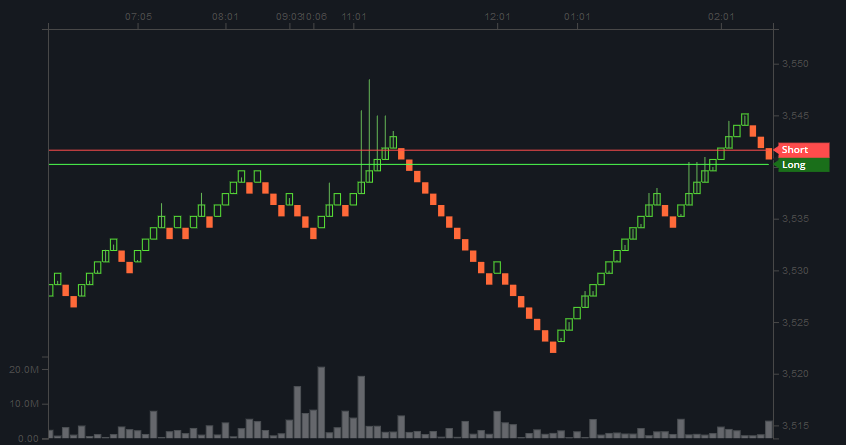

# Настройки Индикаторов

Чтобы еще больше ограничить торговые критерии для вашей стратегии, вы можете использовать ряд подтверждающих индикаторов для обычных ордеров на покупку и продажу. На этой странице описаны все параметры настройки, доступные для подтверждения индикаторов. 

Заказы размещаются, когда основные настройки стратегии и подтверждающие индикаторы соответствуют рыночной ситуации. Когда TrailMe также используется, он должен завершить трейлинг, пока выполняются другие условия. Все эти условия должны происходить в одном и том же цикле. 

Особенно, когда TrailMe используется вместе с подтверждающими индикаторами, имеет смысл не устанавливать слишком строгие индикаторы, так как все критерии ордера должны выполняться в одном и том же цикле для размещения ордера \(условия стратегии + условия индикатора + срабатывание трейлинг-стопа\). 


**Показатели в Gunbot рассчитываются с живыми данными.** 

Например, для расчета RSI за 14 периодов это означает, что используются значения закрытия периода для последних 13 завершенных свечей плюс текущие данные для текущего цикла. 

**Биржи не предоставляют данные индикатора.** 

Gunbot должен рассчитывать свои собственные данные индикатора, так как биржи предоставляют только [необработанные данные](https://tulipindicators.org/) для расчета индикаторов. 

Хотя мы используем, на наш взгляд, лучшую библиотеку для индикаторов, всегда возможно, что биржи или TradingView показывают немного разные значения индикаторов, потому что они выбрали другой способ их расчета. 



Для маржинальной торговли сторона покупки для настроек индикатора применяется для открытия длинной позиции. Сторона продажи применяется для открытия коротких позиций.


## ADX 

### ADX Enabled 

Установка этого значения в true включит ADX в качестве подтверждающего индикатора, позволяя торговать только тогда, когда тренд достаточно сильный, чтобы соответствовать или превышать установленный ADX\_LEVEL. 

ADX измеряет как восходящий, так и нисходящий тренды, когда DI + ниже, чем DI- цены движутся вверх \(эти значения видны в журналах\). Когда DI- ниже, чем DI +, цены снижаются. Значение ADX указывает на силу текущего восходящего или нисходящего тренда. 

Ордер на покупку подтверждается, когда ADX выше ADX\_LEVEL, а DI- ниже DI +. 

Ордер на продажу подтверждается, когда ADX выше ADX\_LEVEL, а DI- выше DI +.

**Values:** true or false

**Default value:** false

Parameter name in `config.js`: `ADX_ENABLED`

### ADX Level 

Устанавливает минимальный уровень тренда, который должен быть достигнут, чтобы ордера были разрешены. 

При значении 25 сделки будут размещены, как только ADX достигнет 25 или выше.

**Values:** числовые, в диапазоне от 1 до 99.

**Default value:** 25

Parameter name in `config.js`: `ADX_LEVEL`

### DI Period 

Устанавливает количество свечей, используемых для расчета ADX.

**Values:** числовой, представляет количество периодов.

**Default value:** 14

Parameter name in `config.js`: `DI_PERIOD`

## BTC PND защита 

### BTC PND Защита 

Значение true отключает ордера на покупку, когда на BTC слишком много ценового и объемного давления. 

Этот параметр зависит от `BTC_MONEY_FLOW`. Используйте это только в том случае, если изменение цены BTC оказывает существенное влияние на вашу торговую пару.

**Values:** true or false

**Default value:** false

Parameter name in `config.js`: `BTC_PND_PROTECTION`

### BTC Money Flow - Денежный поток 

Устанавливает значение индекса денежного потока \(MFI\) для BTC-USD, для которого `BTC_PND_PROTECTION` отключает ордера. Как только MFI достигнет установленного значения или опустится ниже его, `BTC_PND_PROTECTION` будет активен. 

Значение по умолчанию 35 указывает, что рынок BTC-USD движется в область перепроданности и может вскоре начать двигаться, ордера на покупку размещаться не будут, пока МФО BTC-USD находится между 35 и 0. 

Пока BTC-USD является определенной территорией перепроданности, заказы размещаться не будут.

**Values:** числовые, в диапазоне от 1 до 99.

**Default value:** 25

Parameter name in `config.js`: `BTC_MONEY_FLOW`

### BTC PND Period 

Установите это количество свечных периодов, которые вы хотите использовать для расчета MFI для`BTC_PND_PROTECTION`.

**Values:** числовой, представляет количество периодов.

**Default value:** 14

Parameter name in `config.js`: `BTC_PND_PERIOD`

## EMA Spread 

### EMA Spread 

Если установить значение true, спрэд EMA станет подтверждающим индикатором для ордеров на покупку и продажу. Разброс рассчитывается каждый цикл путем вычитания самого низкого значения EMA из самого высокого EMA. 

Сигнал на покупку возникает, когда EMA1 \(медленная EMA\), по крайней мере, `EMAx` выше, чем EMA2 \(быстрая EMA\), и значение спреда EMA начинает уменьшаться \(после первого увеличения\). 

Сигнал на продажу возникает, когда EMA1 \(медленная EMA\), по крайней мере, EMAx ниже, чем EMA2 \(быстрая EMA\), и значение спреда EMA начинает увеличиваться \(после того, как оно сначала уменьшилось\).

**Values:** true or false

**Default value:** false

Parameter name in `config.js`: `EMASPREAD`

### EMAx 

Устанавливает минимальную процентную разницу между медленной и быстрой EMA для `EMASPREAD`. 

При значении 1 спред должен достичь не менее 1%, прежде чем `EMASPREAD`сможет инициировать покупку или продажу.

**Values:** числовой, представляет количество периодов.

**Default value:** 0.5

Parameter name in `config.js`: `EMAx`

## MFI 

### MFI Enabled 

Если установить для этого параметра значение true, Gunbot будет торговать только при выполнении условий стратегии и `MFI_BUY_LEVEL` / `MFI_SELL_LEVEL`. 

Если вы хотите использовать этот индикатор только для покупки или продажи, но не для обоих, установите сторону, которую вы не хотите использовать, равной -1001

**Values:** true or false

**Default value:** false

Parameter name in `config.js`: `MFI_ENABLED`

### MFI Buy Level 

Определяет максимальный уровень MFI, на котором вы хотите разрешить ордера на покупку. 

При значении 30 ордера на покупку будут размещаться, только если MFI находится в диапазоне от 0 до 30.

**Values:** числовые, в диапазоне от 1 до 99.

**Default value:** 30

Parameter name in `config.js`: `MFI_BUY_LEVEL`

### MFI Sell Level 

Установите минимальный уровень MFI, на котором вы хотите разрешить продажи. 

Например: при значении 70 ордера на продажу будут размещаться только тогда, когда MFI находится между 70 и 100.

**Values:** числовые, в диапазоне от 1 до 99.

**Default value:** 70

Parameter name in `config.js`: `MFI_SELL_LEVEL`

### MFI Length - Длина 

Установите это количество свечных периодов, которые вы хотите использовать для расчета MFI. 

MFI рассчитывается с использованием массива цен закрытия периода свечей MFI\_LENGTH-1 и последней цены.

**Values:** числовой, представляет количество периодов свечи.

**Default value:** 14

Parameter name in `config.js`: `MFI_LENGTH`

## RSI 

### RSI Buy Enabled 

Если установить для этого параметра значение true, Gunbot будет покупать только тогда, когда выполнены оба условия стратегии и `RSI_BUY_LEVEL`.

**Values:** true or false

**Default value:** false

Parameter name in `config.js`: `RSI_BUY_ENABLED`

### RSI Sell Enabled 

Если установить для этого параметра значение true, Gunbot будет продавать только тогда, когда выполнены оба условия продажи стратегии и `RSI_SELL_LEVEL`

**Values:** true or false

**Default value:** false

Parameter name in `config.js`: `RSI_SELL_ENABLED`

### RSI Method 

Устанавливает метод использования RSI. Смотрите `RSI_BUY_LEVEL` и `RSI_SELL_LEVEL` для подробного описания обоих методов.

**Values:** осциллятор или крест.

**Default value:** oscillator

Parameter name in `config.js`: `RSI_METHOD`

### RSI Buy Level 

Установите для уровня RSI, на котором вы хотите разрешить ордера на покупку. 

`RSI_METHOD` = осциллятор: при значении 40 ордера на покупку будут размещаться только при RSI 40 или ниже. 

`RSI_METHOD` = cross: при значении 40 ордера на покупку будут размещаться только тогда, когда RSI пересекает 40.

**Values:** числовые, в диапазоне от 1 до 99.

**Default value:** 30

Parameter name in `config.js`: `RSI_BUY_LEVEL`

### RSI Sell Level 

Установите для этого уровня RSI, на котором вы хотите разрешить ордера на продажу. 

`RSI_METHOD` = осциллятор: при значении 60 ордера на продажу будут размещаться только при значении RSI 60 или выше. 

`RSI_METHOD` = cross: при значении 60 ордера на продажу будут размещаться только тогда, когда RSI пересекает уровень ниже 60.

**Values:** числовые, в диапазоне от 1 до 99.

**Default value:** 70

Parameter name in `config.js`: `RSI_SELL_LEVEL`

### RSI Length 

Установите это количество свечных периодов, которые вы хотите использовать для расчета RSI. 

RSI рассчитывается с использованием массива цен закрытия периода свечей RSI\_LENGTH-1 и последней цены.

**Values:** числовой, представляет количество периодов свечи.

**Default value:** 14

Parameter name in `config.js`: `RSI_LENGTH`

## Stochastic 

### Stoch Enabled 

Если установить для этого параметра значение true, Gunbot будет торговать только при выполнении условий стратегии и `STOCH_BUY_LEVEL` / `STOCH_SELL_LEVEL`.

Если вы хотите использовать этот индикатор только для покупки или продажи, но не для обоих, установите сторону, которую вы не хотите использовать, равной -1001.

**Values:** true or false

**Default value:** false

Parameter name in `config.js`: `STOCH_ENABLED`

### Stoch Method 

Устанавливает метод использования Stochastic. Смотрите `STOCH_BUY_LEVEL` и `STOCH_SELL_LEVEL` для подробного описания обоих методов.

**Values:** осциллятор или крест.

**Default value:** oscillator

Parameter name in `config.js`: `STOCH_METHOD`

### Stoch Buy Level 

Установите максимальный уровень Стохастика, на котором вы хотите разрешить ордера на покупку. 

При значении 30 ордера на покупку будут размещаться только тогда, когда Stochastic находится в диапазоне от 0 до 30. 

`STOCH_METHOD` = осциллятор: сигнал на покупку возникает, когда Stoch% K и% D ниже установленного уровня покупки. 

`STOCH_METHOD` = cross: сигнал на покупку возникает, когда Stoch% K и% D ниже установленного уровня покупки, кроме того,% K должен пересечь% D.

**Values:** числовые, в диапазоне от 1 до 99.

**Default value:** 30

Parameter name in `config.js`: `STOCH_BUY_LEVEL`

### Stoch Sell Level 

Установите минимальный уровень стохастика, на котором вы хотите разрешить ордера на продажу. 

При значении 70 ордера на продажу будут размещаться только тогда, когда Stochastic находится между 70 и 100. 

`STOCH_METHOD` = осциллятор: сигнал на продажу возникает, когда Stoch% K и% D выше установленного уровня продажи. 

`STOCH_METHOD` = cross: сигнал на продажу возникает, когда Stoch% K и% D выше установленного уровня продажи, кроме того,% K должен пересечь% D.

**Values:** числовые, в диапазоне от 1 до 99.

**Default value:** 70

Parameter name in `config.js`: `STOCH_SELL_LEVEL`

### Stoch K 

Количество периодов, используемых для расчета Стохастика% К.

**Values:** числовой, представляет количество периодов.

**Default value:** 14

Parameter name in `config.js`: `STOCH_K`

### Slow Stoch K 

Количество периодов, используемых для расчета медленного стохастика% K.

**Values:** числовой, представляет количество периодов.

**Default value:** 3

Parameter name in `config.js`: `SLOW_STOCH_K`

### Stoch D 

Количество периодов, используемых для расчета Стохастика% D.

**Values:** числовой, представляет количество периодов.

**Default value:** 3

Parameter name in `config.js`: `STOCH_D`

## StochRSI 

### Stoch RSI Enabled 

Если установить для этого параметра значение true, Gunbot будет торговать только при выполнении условий стратегии и `STOCHRSI_BUY_LEVEL` / `STOCHRSI_SELL_LEVEL`. 

Если вы хотите использовать этот индикатор только для покупки или продажи, но не для обоих, установите сторону, которую вы не хотите использовать, равной -1001.

**Values:** true or false

**Default value:** false

Parameter name in `config.js`: `STOCHRSI_ENABLED`

### Stoch RSI Method 

Устанавливает метод использования StochRSI. Смотрите `STOCHRSI_BUY_LEVEL` и `STOCHRSI_SELL_LEVEL` для подробного описания обоих методов.

**Values:** осциллятор или крест.

**Default value:** oscillator

Parameter name in `config.js`: `STOCHRSI_METHOD`

### Stoch RSI Buy Level - Уровень покупки 

Установите для этого уровня StochRSI, на котором вы хотите разрешить ордера на покупку. 

`STOCHRSI_METHOD` = осциллятор: при значении 0,2 ордера на покупку будут размещаться только тогда, когда StochRSI равен 0,2 или ниже. 

`STOCHRSI_METHOD` = cross: при значении 0,2 ордера на покупку будут размещаться только тогда, когда StochRSI пересекает 0,2.

**Values:** числовое значение в диапазоне от 0,01 до 0,99

**Default value:** 0.2

Parameter name in `config.js`: `STOCHRSI_BUY_LEVEL`

### Stoch RSI Sell Level - Уровень продаж 

Установите для этого уровня StochRSI, на котором вы хотите разрешить ордера на продажу. 

`STOCHRSI_METHOD` = осциллятор: при значении 0,8 ордера на продажу будут размещаться только тогда, когда StochRSI равен 0,8 или выше. 

`STOCHRSI_METHOD` = cross: при значении 0,8 ордера на продажу будут размещаться только тогда, когда StochRSI пересекает уровень ниже 0,8.

**Values:** числовое значение в диапазоне от 0,01 до 0,99

**Default value:** 0.8

Parameter name in `config.js`: `STOCHRSI_SELL_LEVEL`

### Stoch RSI Length 

Установите это количество свечных периодов, которые вы хотите использовать для расчета StochRSI.

**Values:** числовой, представляет количество периодов.

**Default value:** 14

Parameter name in `config.js`: `STOCHRSI_LENGTH`

## Advanced settings - Расширенные настройки 

### EMA Length - Длина EMA 

Установите это количество свечных периодов, которые вы хотите использовать для расчета `EMA1`и `EMA2`. Если вы не используете очень высокие значения EMA, вам обычно не нужно это менять.

**Values:** числовой, представляет количество периодов.

**Default value:** 50

Parameter name in `config.js`: `EMALENGTH`

### Candles Length - Длина свечей 

Установите это количество свечных периодов, которые вы хотите, чтобы Gunbot вытянул с биржи, которые доступны для расчета других индикаторов. 

Всегда проверяйте, достаточно ли высока эта настройка для правильного расчета других индикаторов. 

Обратите внимание, что биржи не всегда предоставляют количество указанных свечей, часто оно меньше.

**Values:** числовой, представляет количество периодов.

**Default value:** 99

Parameter name in `config.js`: `CANDLES_LENGTH`

## Bollinger Bands for DCA 

### SMA Period 

Это определяет количество периодов, используемых для расчета полос Боллинджера. Используется только когда для `DU_METHOD` установлено значение HIGHBB.

**Values:** числовой, представляет количество свечей.

**Default value:** 50

Parameter name in `config.js`: `SMAPERIOD`

### Standard Deviation - Среднеквадратичное отклонение 

Это значение определяет множитель, используемый для расчета полос Боллинджера. Используется только когда для `DU_METHOD` установлено значение HIGHBB.

**Values:** числовой \(рекомендуется: от 1,9 до 2,1\) - представляет значение множителя, используемого при расчете полос Боллинджера.

**Default value:** 2

Parameter name in `config.js`: `STDV`

## Renko candles 

Свечи [Ренко ](https://github.com/boekenbox/gitbook/tree/74bed25d66f4b0422a81f67f250bcb09c6cf1780/wiki/Renko_Charts/README.md)можно использовать со стратегией Ишимоку-маржа.

### Use Renko - Использование Renko 

Установка этого значения в true позволит использовать свечи Ренко вместо обычных свечей.

**Values:** true or false

**Default value:** false

Parameter name in `config.js`: `USE_RENKO`

### Renko Period 

Устанавливает, какой обычный размер свечи используется в качестве входных данных для свечей Ренко. Убедитесь, что для `PERIOD`установлено то же значение, что и для `RENKO_PERIOD`.

**Values:** Числовой

**Default value:** 15

Parameter name in `config.js`: `RENKO_PERIOD`

### Renko Brick Size - Размер кирпича 

Определяет размер кирпича для каждой свечи. 

Например, если для пары с долларом США в качестве базовой валюты задано значение 1, каждая свеча Ренко будет отображать изменение цены как минимум на 1 доллар США. 

Если вы не знакомы с графиками Ренко, рекомендуется сначала установить размер кирпича на наименьший возможный шаг, например, 1 доллар США или 0,00000001 BTC, и посмотреть, как он влияет на график \(не закрывайте график, чтобы проверить, как новые ценовые движения визуализируются\). Затем продолжайте увеличивать размер кирпича, пока не получите хорошее представление о том, как ведет себя график.

**Values:** Числовой

**Default value:** 0.0001

Parameter name in `config.js`: `RENKO_BRICK_SIZE`

### Renko ATR 

Включите это, чтобы динамически регулировать размер кирпича на основе среднего истинного диапазона \(ATR\). 

Для фиатных пар 1 пункт равен 1 центу. Для крипто, 1 пункт равен 1 сатоши.

**Values:** true or false

**Default value:** false

Parameter name in `config.js`: `RENKO_ATR`

